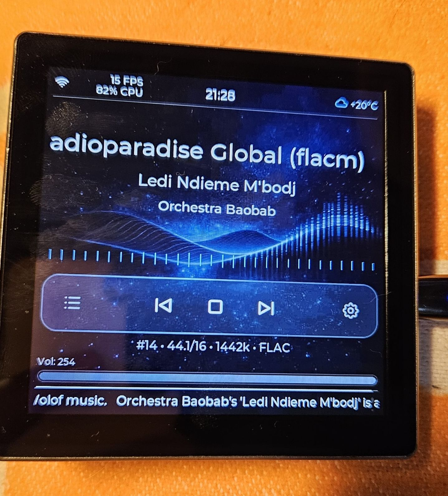

[Back to the English project README](readme_english.md) — [Russian board guide](README_4848S040.md)

# YoRadio LVGL for ESP32-4848S040

This is the hardware guide for ESP32-4848S040, the board supported by the public YoRadio LVGL beta. It covers specifications, audio wiring, configuration, ready-to-flash packages, first start, and touch controls. For the interface, themes, and Web UI, see the [full English project README](readme_english.md).

Public project version: `0.9.434m-r2-lvgl-beta.3`. Current source: `0.9.434m-r2-lvgl-beta.3`.

The supported module provides **16 MB Flash** and **8 MB PSRAM**.

<p align="center">
  
</p>

## Hardware specifications

| Item | Value |
|---|---|
| MCU | ESP32-S3-WROOM-1-N16R8, 240 MHz dual core |
| Flash | 16 MB |
| PSRAM | 8 MB Octal |
| Display | ST7701S RGB panel, 480×480 |
| Touch | GT911 over I2C |
| USB / power | USB-C |
| Filesystem | LittleFS |
| Default audio | External I2S DAC or amplifier |

## What you need

- ESP32-4848S040 board.
- USB-C cable and a suitable power supply.
- External I2S DAC or amplifier with an I2S input, recommended for normal use.
- Wires for the rear connector.
- Powered speakers or an amplifier connected to the DAC output.
- [PlatformIO](https://platformio.org/) if you intend to build from source.

## Audio

The default YoRadio LVGL configuration for ESP32-4848S040 uses an **external I2S DAC** connected to the rear header. This is the primary audio path. A suitable external DAC or I2S amplifier can provide stereo output.

The board's built-in mono audio path is optional and is mainly useful for initial setup or a quick board check before an external DAC is connected. Enable it only when appropriate for your board revision by configuring the **R21 / R22 / R23** jumpers.

The configuration disables an external VS1053 decoder with `VS1053_CS=255`; decoded audio is sent through I2S.

### External DAC wiring

| Signal | GPIO | Purpose |
|---|---:|---|
| DATA / DOUT | 40 | I2S audio data |
| BCLK | 1 | Bit clock |
| LRCK / WS / LRC | 2 | Left/right word select |
| GND | — | Common ground |
| Power | — | Follow the DAC requirements |

Rear connector and I2S lines:

<p align="center">
  
</p>

Built-in mono path jumpers R21, R22, and R23:

<p align="center">
  
</p>

Rear side of the board:

<p align="center">
  
</p>

Check the markings and schematic for the exact electrical details of your board revision.

## Configuration

1. Copy `src/myoptions_4848S040.h` over `src/myoptions.h`.
2. In `src/myoptions.h`, set `L10N_LANGUAGE` to `RU`, `EN`, `PL`, or `SK`.
3. Select the PlatformIO environment `[env:4848S040]`.
4. Configure Wi-Fi and stations on first start and through the Web UI or files under `data/`.

The language selector belongs in `src/myoptions.h`; it is not a `platformio.ini` runtime setting. Source-build requirements, including the KnownGood ESP-IDF library set, are documented in the [English project README](readme_english.md#source-build-note) and `platformio.ini`.

## Ready-to-flash packages

Ready-to-flash packages for `0.9.434m-r2-lvgl-beta.3` are in [`build_bin/4848S040/`](build_bin/4848S040/) for **RU / EN / PL / SK**. Firmware source commit: `eaeef984666499f47d006538841b355259b3352c`. Hashes are in the language-folder READMEs. Device RC smoke (B3-P7) is still pending.

Each language folder contains:

- `bootloader.bin`;
- `partitions.bin`;
- `boot_app0.bin`;
- `firmware.bin`;
- `littlefs.bin`.

Use all files from one language folder. Never mix firmware and LittleFS from different language folders. LittleFS contains the matching Web UI, assets, and AI prompt.

The complete five-file address map, current package metadata, and Espressif Flash Download Tool instructions are in [`build_bin/4848S040/README.md`](build_bin/4848S040/README.md). They are intentionally not duplicated here.

## First start

On power-up, YoRadio shows the boot screen and tries the saved network. If no usable network is configured, Wi-Fi Setup / Recovery opens: scan, select a network, enter its password when required, and save. The device restarts and opens Main.

If Recovery remains idle, YoRadio starts the open `yoRadioAP` access point. Connect to it and continue configuration through the Web UI at the access-point IP address.

## Touch controls

ESP32-4848S040 uses touchscreen control; no encoder is connected in the default configuration.

| Gesture | Action |
|---|---|
| Horizontal swipe | Change Info / Main / Visual / Stations / Weather / Settings |
| Drag the Main volume slider | Adjust volume |
| Vertical swipe on Stations | Browse the station list |
| Downward swipe from the top edge on Info / Main / Visual / Weather | Open Preset Temporary |
| Tap / long press in Preset Temporary | Play the saved station / save the current station to the slot |
| Tap in Screensaver | Exit the Screensaver |
| Short BOOT press during Deep Sleep | Wake the device (see the section below) |

## Deep-Sleep wakeup

Sleep Device puts the board into Deep Sleep. The GT911 touchscreen is not a wake source, but wake through the configurable `WAKE_PIN` is supported; the stock setup uses the BOOT button on GPIO0 with active level LOW.

Default configuration (`src/myoptions.h`, `src/myoptions_4848S040.h`):

```cpp
#define WAKE_PIN      0     // stock BOOT button
#define WAKE_LEVEL    LOW   // BOOT shorts GPIO0 to GND
```

The stock **BOOT** button sits on **GPIO0** and shorts it to GND when pressed, so wakeup works with no extra wiring and no external pull — the board already provides one.

GPIO0 is also used by the RGB panel as `ST7701_R4` (a red-channel data line). To keep that from conflicting, the firmware calls `rtc_gpio_deinit()` at the very start of `setup()` — before config and display init — returning GPIO0 from RTC IO to digital GPIO. The log shows:

```text
[WAKE] cause=EXT0
[WAKE] pin=0 restored to digital GPIO
```

**Procedure:**

1. Enter Deep Sleep through Settings → TIMERS → DEEP SLEEP (`SLEEP NOW`, see below), or with `deepsleep` over telnet/Serial. Wait until the display and backlight are fully off.
2. Press BOOT briefly and release.
3. The board boots normally.

> **Warning.** Do not press BOOT while the display is running — GPIO0 is carrying RGB panel data at that moment.

> **Warning.** Do not hold BOOT through a hardware Reset. GPIO0 is a boot strapping pin, and holding it LOW across Reset puts the chip into download mode instead of booting.

Reset and reconnecting power remain fallback ways to start the board. `WAKE_PIN=255` disables GPIO wake entirely (it does not affect the RTC timer below). The stock ESP32-4848S040 pin map has no free RTC GPIO other than GPIO0, so BOOT/GPIO0 stays the default for this profile. Another board or a modified pin map may use a different free RTC GPIO (GPIO0–21 on ESP32-S3) with LOW or HIGH as the active level.

### TIMERS page and relative RTC wake

Settings → **TIMERS** has **RADIO** and **DEEP SLEEP** tabs. Each tab exposes two events with independent ON/OFF switches and `−/+` controls for `HOURS` (0–24) and `MINUTES` (0–59). A short press changes only that field by one without wrapping or carrying; holding repeats and accelerates. OFF preserves the displayed value while disabling its controls. ON with `00:00` shows `SET INTERVAL` and cannot start that event. A preset is persisted as one 0…1499-minute value, while an armed countdown is runtime-only and does not survive reboot. Only one plan may run at a time.

**RADIO:** `STOP RADIO AFTER` and `START RADIO AFTER` are independent intervals measured from one press of `START TIMER`. Stop-only, Start-only, and two-event plans are supported. With both switches ON, Start must be strictly later than Stop: a conflict shows a warning and disables the start button without changing either value automatically. Events use the normal `PR_STOP` / `PR_PLAY` paths, and an already satisfied state is a safe no-op. Pending Radio Stop appears as `SLEEP 10m`, delayed Deep Sleep as `DEEP SLEEP 10m`; Radio Start remains hidden.

**DEEP SLEEP:** `DEEP SLEEP AFTER` starts at `START TIMER`; the separate `WAKE AFTER SLEEP` interval starts only when managed shutdown actually enters Deep Sleep. Therefore Sleep `5 MIN` plus Wake `3 MIN` is valid: entry occurs after five minutes and RTC wake about three minutes later. With Sleep OFF and Wake ON, `WAKE AFTER NEXT SLEEP` is a persisted preset rather than an active countdown; it is applied by the next `SLEEP NOW` or `deepsleep`. Wake OFF skips RTC timer registration while BOOT/Reset/power remain available. Wake ON with `00:00` blocks sleep until an interval is set. Cancel an active plan explicitly before switching plan types.

BOOT and the RTC timer can be armed **together**; whichever fires first wins. Absolute `HH:MM` wake scheduling is not implemented. `STOPS/STARTS/SLEEP/WAKE AT ...` is only a local-time hint, and `CLOCK NOT SYNCED` never blocks a relative timer. Long RTC intervals can drift with the board's slow clock.

| Telnet / Serial command | Exact semantics |
|---|---|
| `sleeptimer N` | Radio Stop after `N` minutes; `SLEEP Nm` status; no UI-preset change |
| `sleeptimer 0` | Cancel only Radio Stop |
| `playtimer N` / `playtimer 0` | Set / cancel only Radio Start; no status indicator |
| `deepsleep` | Queue immediate managed sleep with the persisted wake preset; may cancel Radio timers |
| `deepsleep N` / `deepsleep 0` | Set / cancel Deep Sleep after `N` minutes; status `DEEP SLEEP Nm` |
| `sleep N` | Backward compatibility with the old CLI: immediate Deep Sleep with a one-shot wake after `N` minutes |
| `sleep N M` | Backward compatibility with the old CLI: Deep Sleep after `M` minutes, then a one-shot wake after `N` minutes |

The new `sleeptimer`, `playtimer`, and `deepsleep` commands are parsed before the Wi-Fi gate, so they work identically over Serial. Negative values, junk tails, overflow, and values above 1499 are rejected. A one-shot wake supplied by the backward-compatible old `sleep` command never changes `WAKE AFTER SLEEP`. Every entry converges on one pipeline: a mutex-guarded pending flag → DspTask accepts it in `sleep_timer_loop()` → player stop → flush → display off → settle → sole EXT0/RTC registration immediately before `esp_deep_sleep_start()`. Before entry it logs a line such as `[SLEEP] entering deep sleep; RTC wake in 60 min at 2026-09-13 14:35 local`; without a synchronized clock the exact interval is still printed without `at`.

A generic left/right swipe changes pages; it does not control volume.

## GPIO reference

The values below follow `src/myoptions_4848S040.h`.

| Function | GPIO |
|---|---|
| Display CS / SCK / SDA for the software control bus | 39 / 48 / 47 |
| Display DE / VSYNC / HSYNC / PCLK | 18 / 17 / 16 / 21 |
| Display RGB data | 16-bit RGB bus; see `src/myoptions_4848S040.h` |
| Backlight PWM | 38 |
| GT911 touch SDA / SCL | 19 / 45 |
| I2S DATA / BCLK / LRCK | 40 / 1 / 2 |
| BOOT button / Deep-Sleep wake (`WAKE_PIN`, active LOW) | 0 — shared with `ST7701_R4` |
| Physical MUTE button (`BTN_MUTE`, optional) | 255 — not wired by default |
| Amplifier mute/enable output (`MUTE_PIN`, optional) | 255 — not wired by default |

The SD pins in this configuration are not used for playback in the public beta.

**MUTE.** `BTN_MUTE` is an optional physical button to GND with an internal pull-up (`BTN_INTERNALPULLUP`). `MUTE_PIN` is an independent, optional 3.3 V GPIO output that `Player::setOutputPins()` drives as a separate amplifier mute/enable line — not the same signal as the button. Both default to disabled (`255`) on ESP32-4848S040: no GPIO is claimed and no handler is registered. If your board or amplifier supports a hardware mute/enable line, set a free GPIO in `src/myoptions_4848S040.h`.

## Links

- [Full English project README](readme_english.md)
- [Russian board guide](README_4848S040.md)
- [Ready-to-flash package](build_bin/4848S040/)
- [Flash Download Tool guide](build_bin/4848S040/README.md)
- [Repository](https://github.com/Witaliy76/Yoradio_lvgl)
- [Issues](https://github.com/Witaliy76/Yoradio_lvgl/issues)
- [GNU GPL v3 or later](LICENSE)
