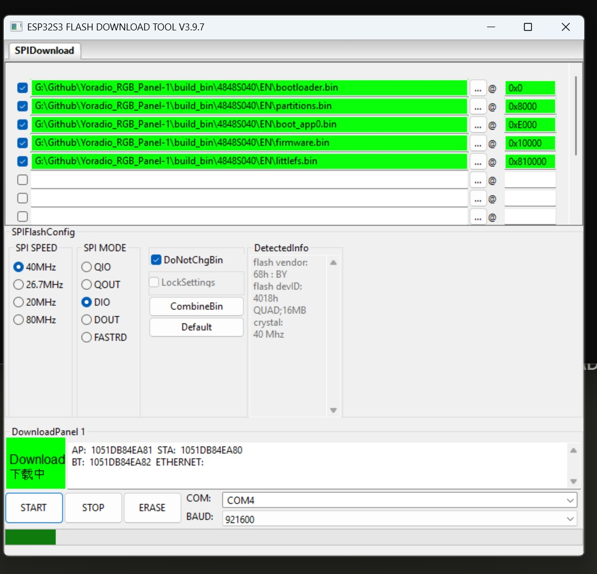

## Русская часть

# YoRadio 4848S040 — прошивка

Плата: **ESP32-4848S040** (ST7701S RGB, 480×480, 4.0"), окружение PlatformIO
`[env:4848S040]`, board `esp32s3_n16r8` (16 MB Flash / 8 MB PSRAM).

Проект: **YoRadio LVGL** — https://github.com/Witaliy76/Yoradio_lvgl
Версия: `0.9.434m-r2-lvgl-beta.2` (1 августа 2026).
Source commit: `538b95553db44884ad0d75e92f3e8970a78e770c`.
Firmware source commit: `538b95553db44884ad0d75e92f3e8970a78e770c`.
Файловая система: **LittleFS**.

Выберите ровно одну языковую папку — [`RU/`](RU/), [`EN/`](EN/), [`PL/`](PL/) или [`SK/`](SK/)
и прошивайте только файлы из неё. **Не смешивайте** файлы из разных языковых
каталогов: `firmware.bin` и `littlefs.bin` должны быть из одной папки.

### A. FULL INITIAL FLASH — полная прошивка с нуля

Карта адресов подтверждена сборкой `pio run -e 4848S040` + `pio run -e 4848S040 -t buildfs`,
таблицей `partition_16MB_ota_largefs.csv` и flash-аргументами платформы pioarduino
(`framework-arduinoespressif32/tools/pioarduino-build.py`).

| Файл | Адрес | Назначение |
|---|---:|---|
| `bootloader.bin` | `0x0000` | Second-stage bootloader |
| `partitions.bin` | `0x8000` | Partition table |
| `boot_app0.bin` | `0xE000` | OTA boot-select data (инициализирует служебные OTA data, активен `ota_0`) |
| `firmware.bin` | `0x10000` | Application firmware (`app0`) |
| `littlefs.bin` | `0x810000` | LittleFS (Web UI, assets, AI prompt) |

При полной прошивке **не пропускайте** `boot_app0.bin`.

`littlefs.bin` содержит Web UI, файловые assets и AI prompt выбранного языка.
Он **не** содержит пользовательские Wi‑Fi credentials или список станций из NVS.
Запись `littlefs.bin` **полностью перезаписывает** раздел файловой системы —
сохранение ранее записанных файлов LittleFS этим пакетом не обещается.

Прошивка только `firmware.bin` без `littlefs.bin` может оставить старые
Web UI / assets / AI prompt. Для первого полного программирования используйте
все **пять** файлов из одной языковой папки.

## Прошивка через Espressif Flash Download Tool

Это основная инструкция для пользователя Windows, который не использует PlatformIO.

Программа: **Espressif Flash Download Tool** (ESP32-S3 Flash Download Tool).
Версия утилиты может отличаться — ориентируйтесь на названия вкладок и параметры ниже.

1. Выберите папку языка: `RU`, `EN`, `PL` или `SK`.
2. Запустите Espressif Flash Download Tool и выберите chip family **ESP32-S3**.
3. Откройте вкладку **SPIDownload**.
4. Добавьте **все пять** файлов из выбранной языковой папки.
5. Назначьте каждому файлу точный адрес из таблицы ниже.
6. Отметьте галочками **все пять** строк.
7. Выберите **COM**-порт вашего устройства (номер на чужих примерах, в том числе
   `COM3` / `COM4` на screenshot, **не обязателен** — используйте свой порт).
8. Установите Chip / SPI SPEED / SPI MODE / DoNotChgBin / BAUD по таблице настроек.
9. Нажмите **START**.
10. Дождитесь зелёного статуса **FINISH**.
11. При необходимости перезагрузите устройство, если оно не перезапустилось автоматически.

| Файл | Адрес |
|---|---:|
| `bootloader.bin` | `0x0000` |
| `partitions.bin` | `0x8000` |
| `boot_app0.bin` | `0xE000` |
| `firmware.bin` | `0x10000` |
| `littlefs.bin` | `0x810000` |

| Параметр | Значение |
|---|---|
| Chip | ESP32-S3 |
| SPI SPEED | 40 MHz |
| SPI MODE | DIO |
| DoNotChgBin | включено |
| BAUD | 921600 |
| COM | порт, назначенный устройству |

> **SPI MODE:** в актуальном screenshot рабочей прошивки выбран **DIO**.
> При включённом **DoNotChgBin** утилита не переписывает flash-параметры внутри
> бинарников — используйте те же настройки, что на memo ниже.

<p align="center">
  
</p>

### Пример esptool (альтернатива)

```
esptool.py --chip esp32s3 --port <PORT> --baud 921600 \
  --before default_reset --after hard_reset \
  write_flash -z --flash_mode qio --flash_freq 80m --flash_size 16MB \
  0x0000 bootloader.bin \
  0x8000 partitions.bin \
  0xe000 boot_app0.bin \
  0x10000 firmware.bin \
  0x810000 littlefs.bin
```

Замените `<PORT>` на фактический COM-порт (Windows) или `/dev/ttyUSB0` / `/dev/ttyACM0` (Linux/macOS).

### B. FIRMWARE-ONLY UPDATE — обновление только прошивки

- Основной файл: **`firmware.bin`** @ **`0x10000`**.
- LittleFS (Web UI, фоны, AI prompt и т.д.) **не** обновляется.
- Если менялись assets FS — прошейте также `littlefs.bin` @ `0x810000` или выполните полный flash (A).

### C. Важные предупреждения

- Не смешивайте файлы из разных языковых каталогов.
- `firmware.bin` и `littlefs.bin` — только из одной папки `RU` / `EN` / `PL` / `SK`.
- Язык UI — compile-time (`L10N_LANGUAGE`); после прошивки не переключается.
- Перед прошивкой убедитесь, что плата — **4848S040**.

---

## English section

Board: **ESP32-4848S040** (ST7701S RGB, 480×480, 4.0"), PlatformIO `[env:4848S040]`,
board `esp32s3_n16r8` (16 MB Flash / 8 MB PSRAM).

Project: **YoRadio LVGL** — https://github.com/Witaliy76/Yoradio_lvgl
Version: `0.9.434m-r2-lvgl-beta.2` (2026-08-01).
Source commit: `538b95553db44884ad0d75e92f3e8970a78e770c`.
Firmware source commit: `538b95553db44884ad0d75e92f3e8970a78e770c`.
Filesystem: **LittleFS**.

Pick exactly one language folder — `RU/`, `EN/`, `PL/`, or `SK/` — and flash only
those files. **Do not mix** folders: `firmware.bin` and `littlefs.bin` must come
from the same package. Do not skip `boot_app0.bin` on a full flash.

Flash map (same as the Russian table above):

| File | Address |
|---|---:|
| `bootloader.bin` | `0x0000` |
| `partitions.bin` | `0x8000` |
| `boot_app0.bin` | `0xE000` |
| `firmware.bin` | `0x10000` |
| `littlefs.bin` | `0x810000` |

### Espressif Flash Download Tool (Windows)

Primary flashing path for Windows users without PlatformIO: use
**Espressif Flash Download Tool**, chip **ESP32-S3**, tab **SPIDownload**,
all five files checked, addresses from the table, SPI SPEED **40 MHz**,
SPI MODE **DIO** (as on the memo screenshot), **DoNotChgBin** enabled,
BAUD **921600**, COM = your device port.

See the Russian section for the full step list, screenshot, and esptool example.
