[Russian version](README.md)

# YoRadio LVGL

YoRadio LVGL is a Wi-Fi internet radio for ESP32-S3 with a touchscreen display. The interface is built on LVGL 9.5 and includes six main screens that you switch between with a horizontal swipe, plus separate screens for Wi-Fi setup, quick access to favorite stations, and a screensaver.

Besides the on-device UI there is a Web UI for playback, stations, behavior settings, and Appearance — themes, Main screen backgrounds, station artwork, and an optional user text TTF. For audio the project is designed around an external I2S DAC or amplifier.

The project is based on [e2002/yoradio](https://github.com/e2002/yoradio); the current repository is [Yoradio_lvgl](https://github.com/Witaliy76/Yoradio_lvgl).

> **Public version:** `0.9.434m-r2-lvgl-beta.3`
> **Current source:** `0.9.434m-r2-lvgl-beta.3`
> **Validated board:** ESP32-4848S040


## Design and character. Philosophy.

YoRadio is intended as a standalone music device and a physical presence in the room, not as an app relocated onto a small screen. Music remains the main content: the interface helps you listen without demanding constant attention or competing with playback.

The visual language follows a calm Scandinavian hi-fi approach and the character of analog audio equipment: clear typography, quiet composition, restrained accents, and references to classic instruments. In the product this shows, for example, in Visual (Beocord-inspired metering) and in the Amber Hi-Fi palette for the Custom theme. The device should sit naturally in a room and not look like a phone or tablet.

From that follows a practical rule: the normal screen state is calm. The interface does not flash, does not show notifications, and does not ask for a reaction; motion appears only where it carries meaning — in signal metering or in a scrolling long title. The screen is built as an instrument composition: technical status at the top, the listening object in the center, and quiet technical cues and signs of signal life below.

Different pages have different roles: Main is for listening, Visual for atmosphere, Info for device state, Station for selection, Weather for the surroundings, Settings for functional control. No page tries to become a universal menu or to duplicate the others.

## Main features

- Internet radio playback: MP3, AAC, FLAC, OGG/Vorbis, Opus.
- Six-page LVGL 9.5 touchscreen interface: Info, Main, Visual, Station, Weather, Settings.
- Station list with paged navigation.
- Weather — current conditions and forecast (OpenWeatherMap) with a DNS-resilient network path; pressure is shown in mmHg.
- Visual — instrument-style level metering in the spirit of vintage Beocord.
- TIMERS — Radio Stop/Start and Deep Sleep timers with relative RTC wake (`WAKE AFTER SLEEP`).
- Configurable scrolling of long labels (Settings → Display → Scrolling: speed, type, delay) — shared by Main, Info, Weather, and Visual.
- Performance monitor — FPS/CPU readout in Settings → Display, without a reboot; off by default.
- Preset Temporary — quick access to 8 saved stations.
- Analog Screensaver — analog clock while idle. Configured from the Web UI.
- Hardware amplifier MUTE through a configurable `MUTE_PIN`; if needed you can wire a separate `BTN_MUTE` button (to GND with an internal pull-up). Both lines are unused by default on ESP32-4848S040. Configured in myoptions.
- Configurable `WAKE_PIN` for waking from Deep Sleep (on ESP32-4848S040 — BOOT/GPIO0). Configured in myoptions.
- Web UI — player, stations, settings, Appearance, firmware updates.
- Dark / Light / Custom themes, station artwork, and separate Main backgrounds per theme. Theme switching from the Web UI or the Settings page.
- Interface localization RU / EN / PL / SK (selected at build time).
- Scalable TTF fonts and Tabler icons with RU / EN / PL / SK support; optional replacement of normal text with your own TTF via Web UI → Appearance.
- AI Layer — optional quiet information layer over music. Requires an API key. Configured through the Web UI.

## Change history

### 16.09.2026 — 0.9.434m-r2-lvgl-beta.3

Major update to the interface, audio subsystem, power management, and user customization.

- **Display & UI:** move to LVGL 9.5 and a new display backend; improved interface stability and display recovery.
- **Fonts & backgrounds:** new TTF font system with user TTF upload through the Web UI (applied after reboot); Main backgrounds are now stored as JPEG, user backgrounds upload through the Web UI and are fitted to the screen while preserving aspect ratio.
- **Audio & Network:** significantly improved stream stability, HTTPS/AAC/AACP handling, URL and metadata processing, and recovery after temporary network or server failures.
- **Hardware Mute:** full `MUTE_PIN` / `BTN_MUTE` support with unified mute behavior on the device and in the UI.
- **Power & Timers:** Radio Stop/Start and Deep Sleep/Wake timer family, playback resume after wake, configurable WAKE_PIN; on ESP32-4848S040 the current default wake path is GPIO0/BOOT.
- **UI improvements:** configurable shared text scrolling, runtime Performance Monitor control, Visual/Weather/navigation improvements, quick access to Weather, and pressure in mmHg.
- **Reliability:** fixes for settings persistence, display recovery, metadata, and overall firmware stability.

### 28.07.2026 — 0.9.434m-r2-lvgl-beta.2

First public beta of YoRadio LVGL for ESP32-4848S040.

Earlier alpha builds were used for internal development and were not published separately.

## Supported hardware

ESP32-4848S040 is currently the only fully supported and verified board. Support for other modules and hardware profiles is in development. Each supported board has a dedicated guide with wiring, binaries, and hardware specifics.


| Item | Value |
| -------- | ---------------------- |
| Board | ESP32-4848S040 |
| Module | ESP32-S3-WROOM-1-N16R8 |
| Flash | 16 MB |
| PSRAM | 8 MB |
| Display | ST7701S, 480×480 |
| Touch | GT911 (I2C) |


→ **[README_4848S040_english.md](README_4848S040_english.md)** — specifications, audio wiring, configuration, ready-to-flash packages, and board-specific details.

## Interface

You can move between the main pages with a horizontal swipe:

```text
Info ↔ Main ↔ Visual ↔ Station ↔ Weather ↔ Settings
```

Tapping the weather icon in the top status line opens Weather.
On screens that have a return footer pill, tapping it opens Main.

### Main

Main playback screen: station artwork, station and track titles, control bar, volume slider, and information line.

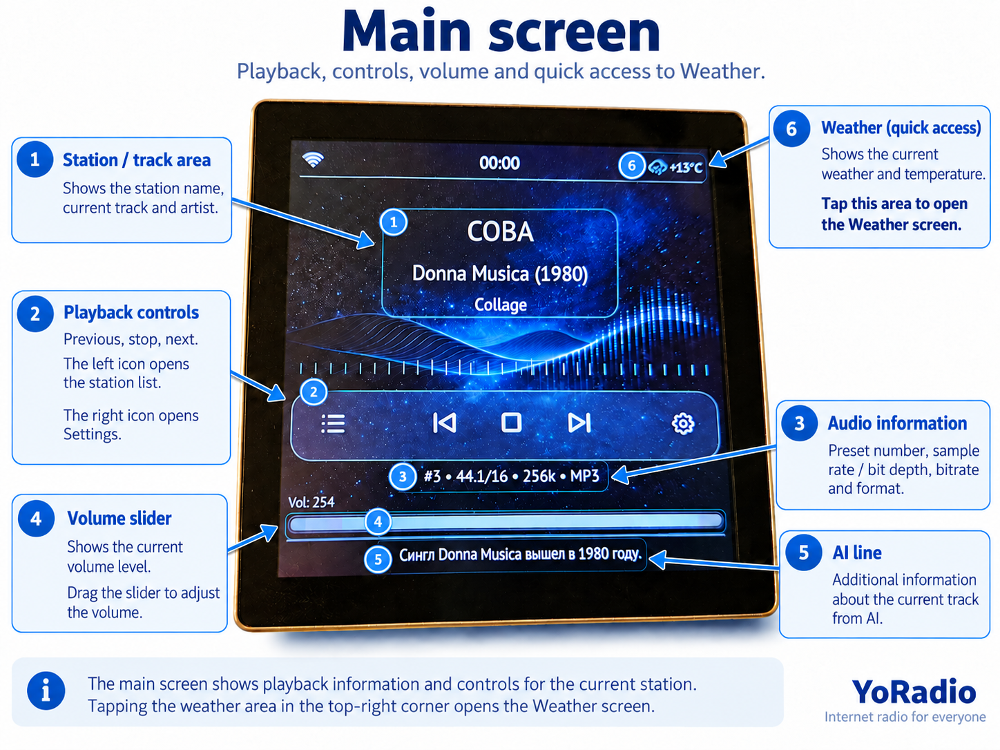

### Info

Technical device information: network and Wi-Fi, firmware version, chip and uptime, display and LVGL, memory and PSRAM.

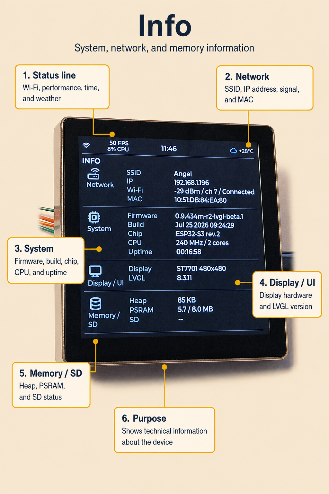

### Visual

Visual is not an arbitrary decorative animation; it is a digital reconstruction of classic meter behavior in the spirit of vintage Beocord instruments. The meter follows the actual decoded audio level: two independent channels with eight segments each from −20 dB to +5 dB, where the last three segments are the red overload zone.

Motion follows instrument ballistics: a fast rise with the signal, about 0.12 s of peak hold, then a smooth fall at a fixed rate. Level is computed from the signal average with limited activity correction and an emphasis on sharp transients — so the scale shows the “body” of the music, not only isolated spikes.

> Response depends on the dynamics of the audio stream itself. If a station sends heavily compressed audio with a nearly constant level, the meter will move in a narrow range. That is a normal reflection of the actual signal, not a Visual fault.

Metering works only while a stream is playing.

The track title under the meter scrolls according to the shared Scrolling settings (Settings → Display → Scrolling) when it does not fit the width.

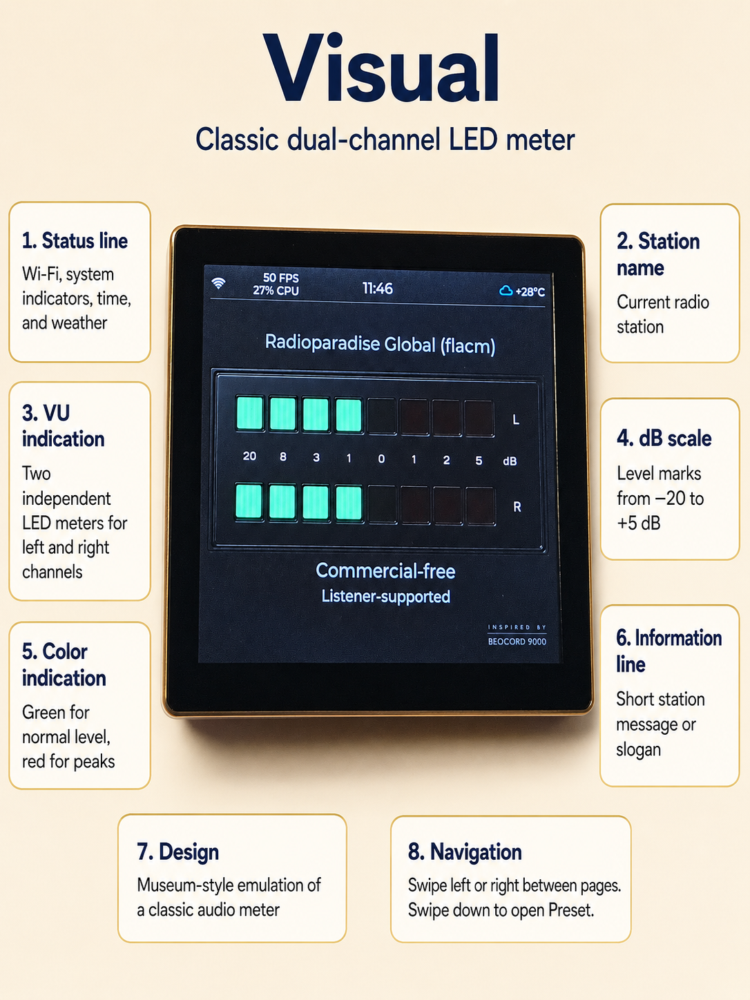

### Station

Radio station list with vertical paging, current position, and an active-station indicator.

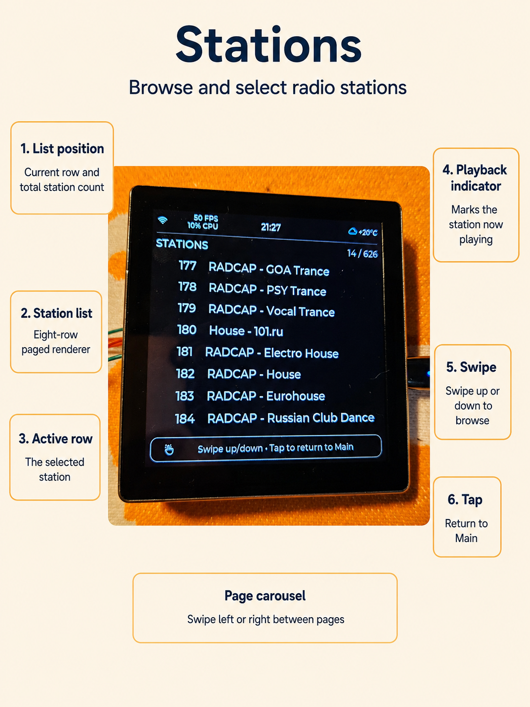

### Weather

Current weather, feels-like temperature, wind, humidity, atmospheric pressure (in mmHg), hourly forecast, and a short multi-day forecast. Data comes from OpenWeatherMap.

Open Weather with a swipe or by tapping the weather icon in the status line from any other page (Info, Main, Visual, Station, Settings).
Weather updates automatically; there is no separate refresh button on the screen.
The bottom footer pill returns to Main.

Weather requests are retried automatically after temporary network or DNS failures and may use fallback DNS servers. This improves Weather resilience when the router or ISP has DNS problems.

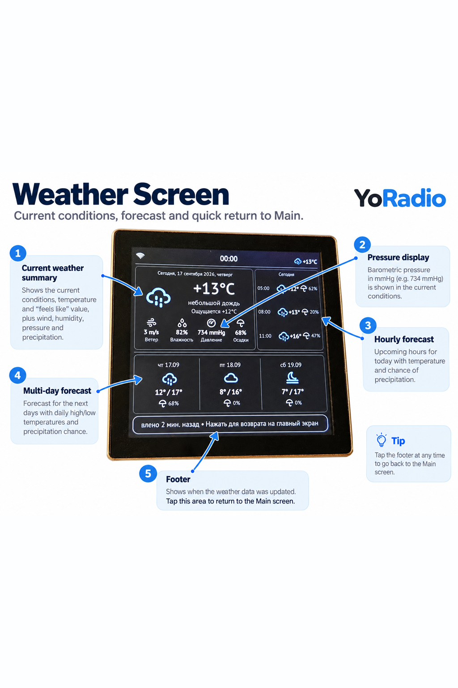

### Settings

Quick access to brightness and display theme, the music meter, auto-resume, the **TIMERS** page, and Wi-Fi setup.

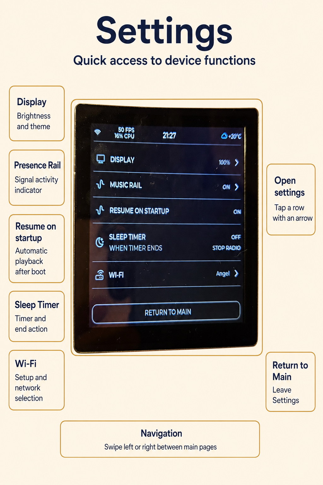

## Additional modes

### Preset Temporary

Quick access to favorite stations. Opened with a downward swipe from the top edge of the screen and available from exactly four pages:

- Info;
- Main;
- Visual;
- Weather.

On Station and Settings this gesture does not open Preset: vertical and service gestures belong to those pages themselves.

8 slots: a short press plays a station, a long press saves the current station to the slot. The screen closes after about 15 seconds of inactivity and returns to the page from which it was opened.

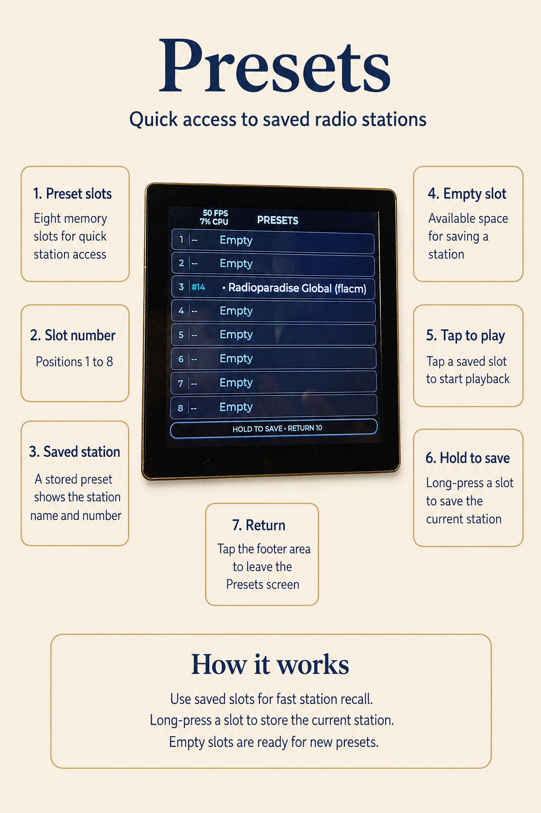

### Display settings

Settings → Display: brightness, Auto Dim, Performance monitor, theme selection, and Scrolling.

**Scrolling** controls long lines: **Speed** — speed, **Type** — scroll mode (Off / Circular / Back and forth), **Delay** — pause before the next pass. The settings are shared by Main, Info, Weather, and Visual.

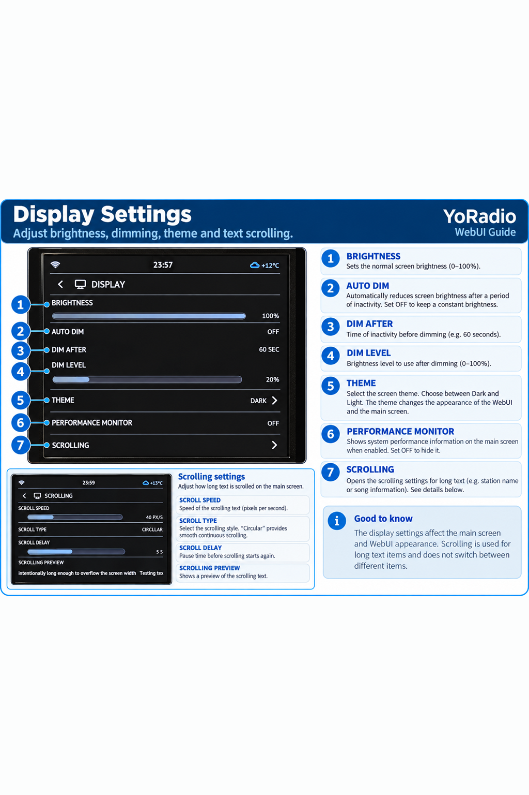

### Screensaver

Full-screen analog clock screensaver. Configured through the Web UI; exit with a screen tap.

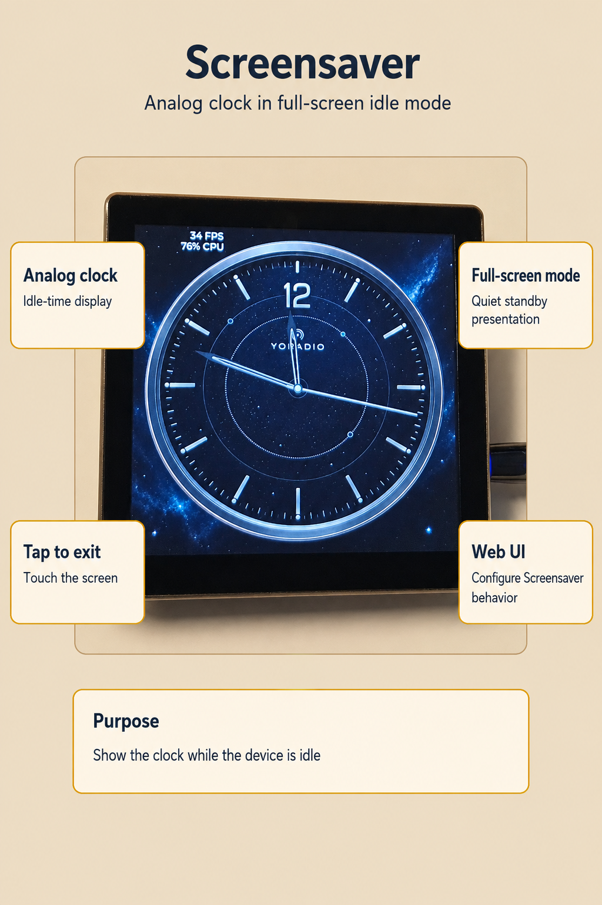

### Timers

Timers run only until the next device reboot and are not restored after a normal reboot. Only one timer mode can run at a time — Radio or Deep Sleep. To switch modes, cancel the active timer first.

On the `RADIO` tab you can configure two independent events: `STOP RADIO AFTER` — how soon to stop the radio, and `START RADIO AFTER` — how soon to start it again. You can use only Stop, only Start, or both. The countdown starts after you press `START TIMER`. If both events are enabled, radio start must be scheduled later than stop; otherwise the UI shows `START MUST BE LATER THAN STOP` and the timer will not start. The status line shows only time until stop, for example `SLEEP 10m`.

On the `DEEP SLEEP` tab, `DEEP SLEEP AFTER` sets how soon the device enters deep sleep. `WAKE AFTER SLEEP` sets how soon it wakes after it has actually gone to sleep. For example, Sleep 5 MIN and Wake 3 MIN means: after 5 minutes the device sleeps, then wakes roughly 3 minutes later.

You can prepare wake alone: if `DEEP SLEEP AFTER` is off and `WAKE AFTER SLEEP` is on, the UI shows `WAKE AFTER NEXT SLEEP`. No countdown is running yet — the wake interval will be used on the next `SLEEP NOW` or `deepsleep` command. If Wake is off, RTC timer wake is disabled, but wake via the hardware button/GPIO still works.

Lines such as `STOPS AT`, `STARTS AT`, `SLEEP AT`, and `WAKE AT` show only an approximate local-clock time for the event. If the clock is not synchronized yet, the UI shows `--:--` / `CLOCK NOT SYNCED`, but the timers themselves keep running. Scheduling for a wall-clock time of day, for example “start the radio at 07:30”, is not implemented.

For normal use the commands below are not required — they are optional Telnet/Serial control.


| Telnet / Serial | Action |
| ------------------------------- | ---------------------------------------------------------------------------------------------------------- |
| `sleeptimer N` / `sleeptimer 0` | Set / cancel only the Radio Stop timer; the preset is unchanged |
| `playtimer N` / `playtimer 0` | Set / cancel only the Radio Start timer; the preset is unchanged |
| `deepsleep` | Immediate managed Deep Sleep with the saved `WAKE AFTER SLEEP`; may cancel active Radio timers |
| `deepsleep N` / `deepsleep 0` | Set / cancel delayed Deep Sleep entry; the saved wake preset is unchanged |
| `sleep N` | Compatibility with the old CLI: immediate managed Deep Sleep with a one-shot wake after `N` minutes |
| `sleep N M` | Compatibility with the old CLI: managed Deep Sleep after `M` minutes with a one-shot wake after `N` minutes from entry |


The commands use the same syntax over Telnet and Serial; Serial remains available without Wi-Fi. The valid range is 0…1499 minutes. A one-shot wake interval from the legacy `sleep` command does not overwrite the saved preset. The Deep Sleep countdown is shown as `DEEP SLEEP Nm`; before actual entry the Serial monitor reports the RTC interval and the calculated local wake time.

Wake from the GT911 touchscreen in Deep Sleep is not supported. Wake through the configured `WAKE_PIN` is supported; on ESP32-4848S040 the EXT0 source is the stock **BOOT** button (GPIO0, active LOW). The RTC timer and BOOT may be enabled together; the first source wins. After any Deep Sleep wake, GPIO0 is returned early from RTC IO to ordinary digital GPIO before RGB panel initialization. Reset and power reconnect remain fallback startup methods. Details — in the [ESP32-4848S040 guide](README_4848S040_english.md#waking-from-deep-sleep).

## Web UI and Appearance

The Web UI is available at `http://<device-IP>/` (the IP is shown on Info): playback control, station list, behavior settings, Appearance, and firmware/filesystem updates.

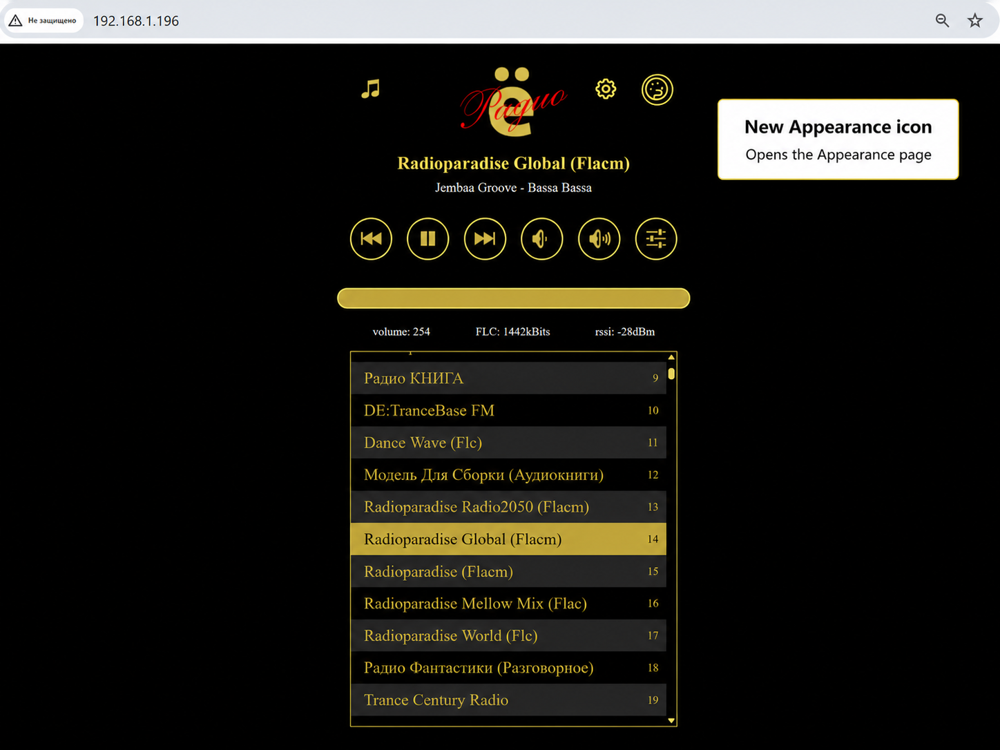

### Station Artwork

Automatic artwork from the radio stream is not supported yet: images are assigned to stations manually. Artwork is tied to the station currently playing, so you can build the library gradually — play a station, upload an image for it, move to the next.

You do not need to prepare the file in advance. The Web UI accepts most common image formats the browser can decode; the image is then centered, cover-cropped, reduced to 120×120, and converted to the device’s internal format. A good source is usually the station’s official site or page.

**Choose image** selects a file and shows a preview; **Upload to device** writes the finished image to the device; **Remove artwork** deletes it.

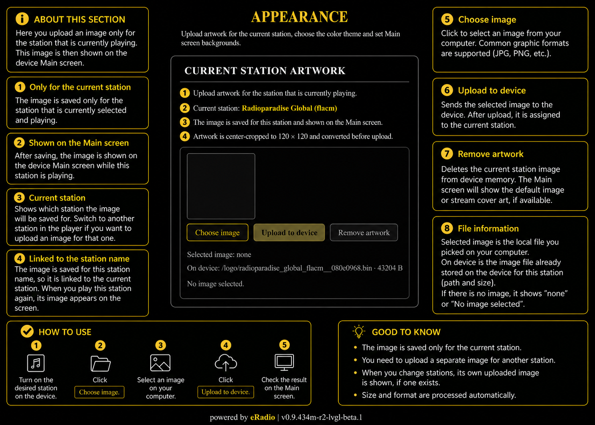

### Color Theme and Custom Palette

**Dark**, **Light**, and **Custom** themes switch immediately and are saved. Dark and Light are built-in factory palettes.

Custom is not just a third preset — it is a fully editable theme. Its palette is described by a plain-text `theme_custom.txt` file: one `key=#RRGGBB` entry per line, up to 4096 bytes; lines starting with `#` are comments. You can open the file in any text editor, change colors, and upload it to the device. Besides colors there are numeric parameters — for example `theme_dark` (`true` / `false`) for a light or dark Custom variant. A complete example with all keys is in the repository: [theme_custom.example.txt](src/src/lvgl_ui/theme/theme_custom.example.txt); key descriptions are in [THEME.md](src/src/lvgl_ui/theme/THEME.md).

**Upload & Apply** uploads the file and applies the palette immediately; **Remove custom palette** deletes the user file and restores the built-in **Amber Hi-Fi** palette. Changes affect Custom only — Dark and Light stay factory.

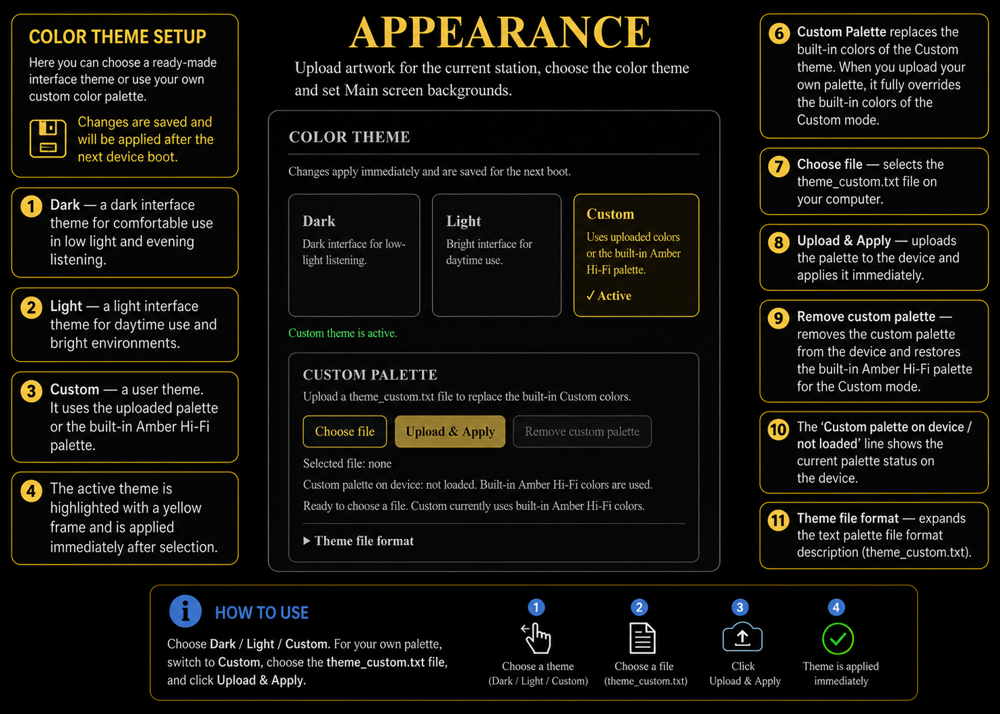

### Main Screen Backgrounds

The background changes only on Main — other pages do not use it. Dark, Light, and Custom have three independent slots, so each theme’s background is configured separately and does not affect the others.

Common formats the browser can decode are accepted. The image keeps its aspect ratio: the long side is limited to 1280 px without cropping, stretching, or upscaling. The browser saves JPEG (quality 0.90) into the selected theme’s user slot. Uploading a background does not switch the active theme.

**Choose image** only prepares a preview; **Upload to device** writes the user JPEG; **Remove image** deletes only that user file. If there is no user file, the theme’s factory JPEG is used; if that is also missing — the theme color.

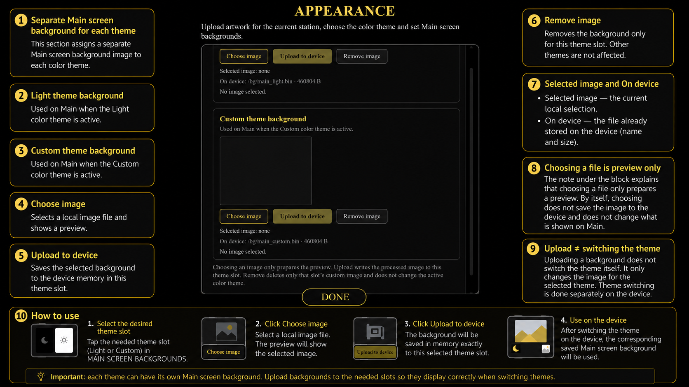

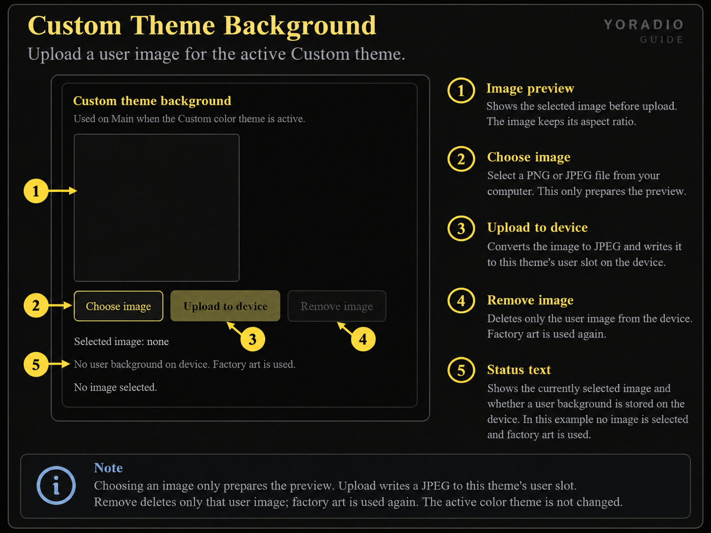

### User text font

Normal interface text can be replaced with your own **TTF** file (not OTF and not icons). Upload and remove it in Web UI → Appearance. Maximum **512 KB**. After a successful upload a **reboot** is required; the live font does not change by itself and there is no automatic reboot. Appearance has an optional **Reboot now** button.

If there is no user file or it is rejected, factory Montserrat remains. Tabler icons are not affected. Optional Play and PT Sans samples are in the repository (`fonts/samples/`) — they are not part of the firmware and are not copied into LittleFS at build time.

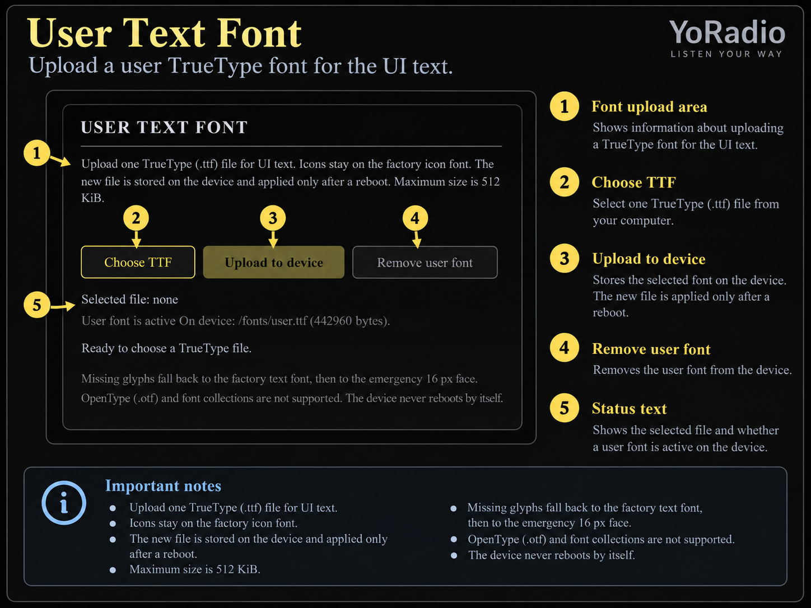

## Differences from the original project

This fork develops YoRadio as a project with a full LVGL touchscreen interface and separate hardware profiles for supported boards. Compared with upstream [e2002/yoradio](https://github.com/e2002/yoradio):

- new LVGL 9.5 UI instead of legacy Canvas screens on the supported board;
- scalable embedded TTF (TinyTTF) instead of compiled per-size fonts;
- six-page navigation ring and separate Boot / Wi-Fi / Preset / Screensaver modes;
- Visual as instrument-style level metering with its own ballistics, not a decorative scale;
- Web UI Appearance: themes, editable Custom palette, independent Main backgrounds, station artwork, and optional user text TTF;
- resilient weather network path with retries and resolver fallback;
- matched network and TLS library profile for stable heavy-stream playback and HTTPS requests during playback;
- LittleFS filesystem;
- compile-time localization RU / EN / PL / SK;
- optional AI Layer as a quiet information layer in the lower Main line;
- emphasis on an external I2S DAC as the primary everyday audio option.

Other board profiles may remain in the sources, but the public beta covers only verified ESP32-4848S040 scenarios.

## AI Layer

AI Layer is an optional quiet layer over music. It is not an assistant, does not hold a dialog, and does not try to fill the screen with text: silence is a normal state for it. It needs an OpenAI-compatible API, key, model, and prompt; without them YoRadio remains a normal internet radio.

The result appears discreetly: a short line in the lower information area of Main, under the stream technical line. The layer does not cover the control bar, volume, or playback metadata, does not open windows, and does not turn the screen into a chat. If there is nothing to say, the line stays empty — AI is not shown on other pages at all.

More detail:

- [AI Layer in YoRadio](readme_ai_layer_eng.md) — purpose and philosophy of the layer;
- [how the prompt works](readme_ai_prompt_explained_eng.md) — language, tone, and output format rules.

## Beta limitations

- Only ESP32-4848S040 is publicly supported.
- Interface language (RU / EN / PL / SK) is chosen at compile time; there is no runtime switch.
- Exit from Deep Sleep is via the configured `WAKE_PIN` (on ESP32-4848S040 — BOOT / GPIO0), the `WAKE AFTER SLEEP` RTC timer, or Reset/power. The touchscreen is not a wake source.
- The Web UI works on the local network, without HTTPS.
- For full audio an external I2S DAC is recommended.

## Getting started

1. Take an ESP32-4848S040 board and prepare power.
2. Ready-to-flash packages for ESP32-4848S040 are in [build_bin/4848S040/](build_bin/4848S040/) for **RU**, **EN**, **PL**, and **SK**. Use `firmware.bin` and `littlefs.bin` from the same language folder. The full address map and Espressif Flash Download Tool guide are in [build_bin/4848S040/README.md](build_bin/4848S040/README.md). Or build the firmware from source.
3. Complete Wi-Fi Setup on first start.
4. Open the Web UI at the device IP address.

Hardware guide for ESP32-4848S040 — DAC wiring, configuration, first start, and control notes:

→ **[README_4848S040_english.md](README_4848S040_english.md)**

### Note on building from source

Build steps:

1. Download or update YoRadio.
2. Open the project in PlatformIO.
3. Press **Build**.

Nothing else is required. Manually replacing ESP-IDF archives inside `.platformio` is **not needed** — the old instructions for copying `.a` files into `framework-arduinoespressif32-libs` are obsolete and unsupported.

PlatformIO downloads the package pinned in [platformio.ini](platformio.ini) itself — PIOArduino `55.03.311` (Arduino-ESP32 `3.3.11`, ESP-IDF `5.5.5`). The shared PlatformIO package stays untouched: YoRadio does not modify or overwrite it.

YoRadio keeps its own overrides in the repository under `library!/esp-idf-5.5.5/s3/`. For S3 that directory holds a matched set of **seven** local ESP-IDF archives (LwIP, Wi-Fi, mbedTLS, and related network/TLS libraries), rebuilt from stock Espressif sources with YoRadio configuration, plus a `manifest.txt` with versions, commits, and SHA256. Graphics `libesp_lcd` is **not** part of that set — the stock ESP-IDF 5.5.5 library is used. This is **not** a normal Arduino library: the files do not need to be copied, installed, or linked individually.

Everything else is done by the build helper `yoradio_build.py`. PlatformIO runs it automatically on every build (`extra_scripts` in `platformio.ini`) — **you do not run it by hand**. The helper checks platform, core, and ESP-IDF versions, verifies the local set’s SHA256, and only then puts it on the linker search path together with the required mbedTLS options.

Validation is all-or-nothing: if the whole set matches, the optimized YoRadio profile is used; if anything fails, the build does not stop — the helper prints a warning and builds against fully stock ESP-IDF libraries. That is a fallback mode, not an error, but it does not give the optimized profile characteristics.

Why the set exists:

- **LwIP** profile — for more resilient long playback of heavy network streams (including FLAC and high bitrate); unbroken playback is not guaranteed — much depends on the station and the link;
- **mbedTLS** profile — so AI Layer HTTPS requests can run during playback while LVGL and the audio decoder are active; the archives are matched as a whole and must not be replaced individually;
- **Wi-Fi** and **LwIP** builds prefer PSRAM for their buffers to keep internal memory for audio and TLS.

Additional notes:

- ESP32-S3 and ESP32-P4 are independent profiles. A custom archive set is currently adopted only for S3; a P4 build uses stock ESP-IDF libraries entirely and does not inherit the S3 archives.
- The Windows build is device-verified. Building with the local set on Linux/macOS has not been verified yet — that is a deferred portability task, not a known firmware bug.
- Everything above applies only to building from source. Ready-to-flash files in `build_bin/` are already built with the intended library set.
- Interface language is set in `src/myoptions.h` via `L10N_LANGUAGE`: `RU`, `EN`, `PL`, or `SK`. There is no runtime language switch.
- A normal build embeds two ready TTF files from [src/src/lvgl_ui/fonts/](src/src/lvgl_ui/fonts/) (`readme_fonts.md`) into application Flash. You do not need to generate fonts by hand, install fontTools, or upload a factory TTF through LittleFS. Optional user text is uploaded separately through the Web UI to the device (`/fonts/user.ttf`); samples in [fonts/samples/](fonts/samples/) are not part of the firmware.
- The sources support RU, EN, PL, and SK. Ready language packages and flashing instructions are in [build_bin/4848S040/](build_bin/4848S040/) and [build_bin/4848S040/README.md](build_bin/4848S040/README.md).

## Credits

- **e2002** — author of the original YoRadio project;
- **Wolle (schreibfaul1)** — AudioI2S library;
- **Maleksm** (4pda.to) — AudioI2S improvements;
- **moononournation** — Arduino_GFX, historical Type9/parity provenance;
- the **LVGL** project — interface graphics engine.

## License and authors

The project is based on [YoRadio](https://github.com/e2002/yoradio) (e2002) and is distributed under the **GNU General Public License v3 or later** — full text in [LICENSE](LICENSE).

Third-party components are listed in [NOTICE](NOTICE). When distributing compiled firmware (`.bin`), GPL v3 requires access to the corresponding sources — this repository and the instructions in `platformio.ini`.

## Feedback

Questions, bugs, and proposals — through [Issues](https://github.com/Witaliy76/Yoradio_lvgl/issues) and [Pull Requests](https://github.com/Witaliy76/Yoradio_lvgl/pulls) of the [Witaliy76/Yoradio_lvgl](https://github.com/Witaliy76/Yoradio_lvgl) repository.
