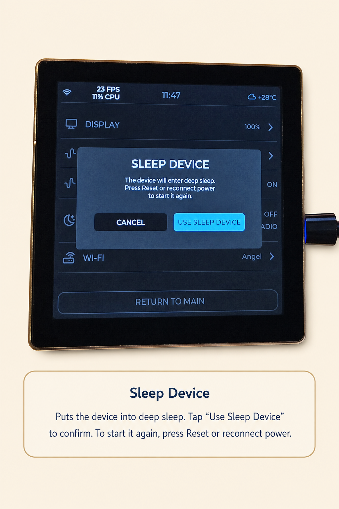

[Russian version](README.md)

# YoRadio LVGL

YoRadio LVGL is an ESP32-S3 Wi-Fi radio with a square touchscreen. Its interface is built on LVGL 9.5 and uses a six-page PageChain, with dedicated Wi-Fi Setup / Recovery, Preset Temporary, and Screensaver screens.

The device is accompanied by a Web UI for playback, stations, behavior settings, and Appearance controls for themes, Main screen backgrounds, and station artwork. The default audio configuration uses an external I2S DAC or amplifier.

The project is based on [e2002/yoradio](https://github.com/e2002/yoradio). The current repository is [Witaliy76/Yoradio_lvgl](https://github.com/Witaliy76/Yoradio_lvgl).

> Public beta: `0.9.434m-r2-lvgl-beta.2`. Supported board: **ESP32-4848S040**.

<p align="center">
  
</p>

## Design and character

YoRadio is intended as a standalone musical instrument and an object of presence, not an application moved onto a small screen. Music remains the main content: the interface supports listening without demanding constant attention or competing with playback.

The visual language follows a calm Scandinavian hi-fi approach and the character of analog audio equipment: clear typography, restrained composition, quiet accents, and references to classic instruments. This is visible in the Beocord-inspired Visual page and the Amber Hi-Fi fallback palette for the Custom theme. The device is designed to sit naturally in a room without resembling a phone or tablet.

Its normal state is calm. The interface does not flash or ask for a response. Movement appears only where it carries meaning, such as signal activity or a scrolling long title. The screen uses a three-zone instrument composition: technical status at the top, the listening object in the center, and quiet technical details and signs of signal life below.

Each page has a distinct role: Main is for listening, Visual for atmosphere, Info for device state, Stations for selection, Weather for the surroundings, and Settings for functional control. No page tries to become a universal menu or duplicate the others.

## Main features

- Internet radio playback: MP3, AAC, FLAC, OGG/Vorbis, and Opus.
- Six-page LVGL 9.5 touchscreen interface: Info, Main, Visual, Stations, Weather, and Settings.
- Paged station list with eight visible rows.
- Weather with current conditions and a forecast from OpenWeatherMap.
- Beocord-inspired Visual with two channels and eight signal segments per channel.
- Preset Temporary for quick access to eight saved stations.
- Analog Screensaver for idle operation.
- Web UI for playback, stations, settings, Appearance, and firmware updates.
- Dark, Light, and Custom themes, station artwork, and separate Main backgrounds for each theme.
- Compile-time RU / EN / PL / SK interface localization.
- Optional AI Layer as a quiet information layer over music.

## Change history

### 08 August 2026 — 0.9.434m-r2-lvgl-beta.2-s0.4

YoRadio migrated from LVGL 8.3.11 to LVGL 9.5.0. The ESP32-4848S040 product UI and behaviour were preserved.

Arduino_GFX remains the current temporary display bridge; direct `esp_lcd` migration is a separate following stage. Generated fonts were migrated to the LVGL9 ABI. Image/runtime descriptor handling and RGB565A8 screensaver assets were adapted for LVGL9.

Two migration regressions were found and fixed: display-task stack sizing and carousel event/screen lifecycle. Device smoke and full functional validation passed. Internal LVGL UI/layout documentation was synchronized.

Public baseline remains `0.9.434m-r2-lvgl-beta.2`.

Current internal development build at migration closeout: `0.9.434m-r2-lvgl-beta.2-s0.4`.
Development builds during the current master plan use the `-s<stage>.<slice>` suffix. `beta.3` is reserved for the next explicitly approved preproduction/public-facing milestone.

### 28 July 2026 — 0.9.434m-r2-lvgl-beta.2

The first public beta of YoRadio LVGL for ESP32-4848S040.

Early alpha builds were used for internal development and were not released separately.

## Supported hardware

ESP32-4848S040 is currently the only fully supported and verified board. Other hardware profiles are in development. Each supported board uses a dedicated guide for wiring, ready-to-flash packages, and hardware-specific details.

| Item | Value |
|---|---|
| Board | ESP32-4848S040 |
| Module | ESP32-S3-WROOM-1-N16R8 |
| Flash | 16 MB |
| PSRAM | 8 MB |
| Display | ST7701S, 480×480 |
| Touch | GT911 over I2C |

→ **[ESP32-4848S040 board guide](README_4848S040_english.md)** — specifications, audio wiring, configuration, ready-to-flash packages, and board details.

## Interface

The six pages form a ring and are changed with a horizontal swipe:

```text
Info ↔ Main ↔ Visual ↔ Stations ↔ Weather ↔ Settings
```

### Main

Main is the playback screen: station artwork, station and track metadata, playback controls, volume level, stream information, and the lower information area. The optional AI line uses the lower area without covering metadata or controls. Presence Rail provides restrained signal activity, and each color theme may have its own optional background.

<p align="center">
  
</p>

### Info

Info presents technical and playback information: network and Wi-Fi state, firmware and chip details, uptime, display and LVGL versions, heap, and PSRAM use.

<p align="center">
  
</p>

### Visual

Visual is a digital reconstruction of a classic indicator mechanism inspired by vintage Beocord instruments. It is not affiliated with or endorsed by Bang & Olufsen.

The display follows the decoded audio signal through two independent channels. Each channel has eight segments spanning −20 dB to +5 dB; the final three segments form the red overload zone. The ballistics use a fast rise, approximately 0.12 seconds of peak hold, and a controlled release. The level combines the signal body with limited activity correction and transient emphasis, so the display responds to musical energy rather than isolated spikes alone.

Strongly compressed radio streams may keep the segments within a narrow range. That is a normal reflection of the stream dynamics, not a Visual fault. The indicators operate only while a stream is playing.

<p align="center">
  
</p>

### Stations

Stations shows the station list, the current position and total count, the active row, and the station currently playing. Its paged renderer displays eight rows at a time. Swipe vertically to browse, tap to return to Main, or swipe horizontally to move through the page carousel.

<p align="center">
  
</p>

### Weather

Weather shows current conditions, feels-like temperature, wind, humidity, pressure, precipitation, hourly points, and a three-day forecast from OpenWeatherMap.

The weather network path retries failed name resolution or connections up to three times in one update cycle. It tries the system DNS first, then Cloudflare at `1.1.1.1`, and Quad9 at `9.9.9.9`. Addresses already attempted in the same cycle are deduplicated, and a working IP from current conditions is preferred for the forecast request. This reduces failures caused by temporary router or provider DNS problems, but it does not guarantee uninterrupted service.

<p align="center">
  
</p>

### Settings

Settings provides direct access to Display brightness and theme, Presence Rail, Resume on Startup, Sleep Timer and its end action, and Wi-Fi setup. Tap a row with an arrow to open its settings.

<p align="center">
  
</p>

## Additional screens and modes

### Preset Temporary

Preset Temporary provides quick access to favorite stations. A downward swipe from the top edge opens it from exactly four pages:

- Info;
- Main;
- Visual;
- Weather.

The gesture does not open Preset Temporary from Stations or Settings because their vertical and service gestures belong to those pages.

There are eight slots. Tap a filled slot to play it; long press to save the current station. After about 15 seconds without activity, Preset Temporary closes and returns to the page from which it was opened.

<p align="center">
  
</p>

### Display settings

Settings → Display contains brightness, Auto Dim, its inactivity delay and dim level, and the theme selector.

<p align="center">
  
</p>

### Screensaver

Screensaver is a full-screen analog clock for idle operation. Its behavior is configured in the Web UI, and a screen tap exits it.

<p align="center">
  
</p>

### Sleep Timer and Sleep Device

Sleep Timer can stop the radio or use Sleep Device as its end action. When Sleep Device is confirmed, playback stops, state is flushed, the display and backlight turn off, and the board enters Deep Sleep. The touch panel does not wake the device. Start it again with Reset or by reconnecting power.

<p align="center">
  
</p>

## Web UI and Appearance

Open `http://<device-IP>/` on the local network. The IP address is shown on Info. The Web UI provides playback controls, the station list, behavior settings, Appearance, and firmware/filesystem updates.

<p align="center">
  
</p>

### Station Artwork

Automatic artwork retrieval from a radio stream is not currently supported. Artwork is assigned manually to the station that is playing, so a library can be built one station at a time.

The browser accepts common image formats it can decode, then centers and cover-crops the image, resizes it to 120×120, and converts it to the device format. **Choose image** selects a file and shows a preview, **Upload to device** stores the processed image, and **Remove artwork** deletes it.

<p align="center">
  
</p>

### Color Theme and Custom Palette

Dark, Light, and Custom apply immediately and are saved. Dark and Light are built-in palettes. Custom accepts a `theme_custom.txt` file with one `key=#RRGGBB` entry per line, up to 4096 bytes. Lines beginning with `#` are comments. Numeric and Boolean settings such as `theme_dark=true` are also supported.

The complete example is [`src/src/lvgl_ui/theme/theme_custom.example.txt`](src/src/lvgl_ui/theme/theme_custom.example.txt), and the key reference is [`src/src/lvgl_ui/theme/THEME.md`](src/src/lvgl_ui/theme/THEME.md).

**Upload & Apply** stores and immediately activates the palette. **Remove custom palette** deletes the uploaded file and restores the built-in **Amber Hi-Fi** fallback. These operations affect Custom only; Dark and Light remain unchanged.

<p align="center">
  
</p>

### Main Screen Backgrounds

Background images are used only on Main. Dark, Light, and Custom have independent slots, so each theme can keep a different image.

The browser accepts common image formats, centers and cover-crops the image, and converts it for the 480×480 display. Uploading a background does not change the active theme. **Choose image** prepares a preview, **Upload to device** stores the selected slot, and **Remove image** clears only that slot. A missing background is a normal state; Main then uses the theme color.

<p align="center">
  
</p>

<p align="center">
  
</p>

## Differences from upstream

This fork develops YoRadio as a touchscreen device with an LVGL interface and board-specific hardware profiles. Compared with [e2002/yoradio](https://github.com/e2002/yoradio), it adds:

- an LVGL 8.3 interface instead of legacy Canvas screens on the supported board;
- a six-page navigation ring plus dedicated Boot, Wi-Fi, Preset Temporary, and Screensaver modes;
- a Beocord-inspired Visual with defined signal ballistics;
- Web UI Appearance controls for themes, an editable Custom palette, independent Main backgrounds, and station artwork;
- a weather request path with retries and resolver fallback;
- matched network and TLS library profiles for demanding streams and HTTPS requests during playback;
- LittleFS;
- compile-time RU / EN / PL / SK localization;
- the optional AI Layer in the lower Main information line;
- an external I2S DAC as the primary everyday audio path.

Other board profiles may remain in the source tree, but this public beta covers only verified ESP32-4848S040 scenarios.

## AI Layer

AI Layer is an optional quiet layer over music. It is not an assistant or chat interface and does not try to keep the screen filled with text. Silence is a normal state. It requires an OpenAI-compatible API, key, model, and prompt; without them, YoRadio remains a conventional internet radio.

When the layer has something useful to add, it uses a short line in the lower Main information area beneath the stream details. It does not cover playback controls, volume, or station metadata, and it does not open dialogs. The line stays empty when there is nothing appropriate to show, and AI content is not shown on other pages.

More information:

- [AI Layer in YoRadio](readme_ai_layer_eng.md);
- [how the prompt works](readme_ai_prompt_explained_eng.md).

## Beta limitations

- ESP32-4848S040 is the only publicly supported board.
- Interface language is selected at compile time; there is no runtime language switch.
- Sleep Device exits only through Reset or power reconnection.
- The Web UI is local-network HTTP without HTTPS.
- An external I2S DAC is recommended for full audio output.

## Getting started

1. Prepare an ESP32-4848S040 and a suitable power supply.
2. Ready-to-flash packages are in [`build_bin/4848S040/`](build_bin/4848S040/) for **RU / EN / PL / SK**. Use `firmware.bin` and `littlefs.bin` from the same language folder. The complete address map and Espressif Flash Download Tool guide are in [`build_bin/4848S040/README.md`](build_bin/4848S040/README.md). You may also build from source.
3. Complete Wi-Fi Setup on first start.
4. Open the Web UI at the device IP address.

For DAC wiring, configuration, first start, and touch controls, see the **[ESP32-4848S040 board guide](README_4848S040_english.md)**.

### Source build note

The source build uses a replaced set of ESP-IDF system libraries. This is required for two practical device characteristics.

The custom **LwIP / esp_netif** profile supports long playback of demanding network streams, including FLAC and high-bitrate stations, by reducing the likelihood of network stalls and buffering failures. It cannot guarantee uninterrupted playback because station and network quality still matter.

The matched **mbedTLS Profile B** is not merely an HTTPS switch. AI Layer can make a TLS request while LVGL and the audio decoder are active. With the stock profile, the TLS handshake could fail when a sufficiently large contiguous internal-memory block was unavailable. Profile B lowers those requirements, while a guard skips a request if the available block is still too small. The archives form one matched profile and must not be replaced individually with arbitrary versions.

- Source builds require the complete KnownGood set in `library!/esp32s3_5_5_2__3_3_6_ai_tls_profile_b_FULL_WORKING_20260603_221741/`. It contains ten matched LwIP, esp_netif, HTTP, and mbedTLS/TLS archives. The older LwIP/esp_netif-only directory is insufficient for this beta.
- The set is for PIOArduino `55.03.36`, Arduino-ESP32 `3.3.6`, and `framework-arduinoespressif32-libs` `5.5.0+sha.f56bea3d1f` based on ESP-IDF `5.5.2`.
- Replace the matching files in `framework-arduinoespressif32-libs/esp32s3/lib/`, restart PlatformIO, clean the project, and rebuild.
- The ten files are `libesp_http_client.a`, `libesp_netif.a`, `libesp-tls.a`, `libhttp_parser.a`, `liblwip.a`, `libmbedcrypto.a`, `libmbedtls.a`, `libmbedtls_2.a`, `libmbedx509.a`, and `libtcp_transport.a`.
- Target directory: Windows — `%USERPROFILE%\.platformio\packages\framework-arduinoespressif32-libs\esp32s3\lib\`; Linux/macOS — `~/.platformio/packages/framework-arduinoespressif32-libs/esp32s3/lib/`.
- Repeat the replacement after reinstalling or updating the framework package.
- This replacement is only for source builds. Ready-to-flash packages in `build_bin/` already include the required profile.
- Select the interface language in `src/myoptions.h` with `L10N_LANGUAGE`: `RU`, `EN`, `PL`, or `SK`. There is no runtime language switch.

## Credits

- **e2002** — original YoRadio project;
- **Wolle (schreibfaul1)** — AudioI2S;
- **Maleksm** (4pda.to) — AudioI2S improvements;
- **moononournation** — Arduino_GFX;
- **LVGL** — interface graphics engine.

## License and authors

This project is based on [YoRadio](https://github.com/e2002/yoradio) and is distributed under the **GNU General Public License v3 or later**. See [`LICENSE`](LICENSE).

Third-party components are listed in [`NOTICE`](NOTICE). GPL v3 requires distributors of compiled firmware to provide access to the corresponding source; this repository and its `platformio.ini` instructions provide that source context.

## Feedback

Questions, bug reports, and proposals are welcome through [Issues](https://github.com/Witaliy76/Yoradio_lvgl/issues) and [Pull Requests](https://github.com/Witaliy76/Yoradio_lvgl/pulls) in [Witaliy76/Yoradio_lvgl](https://github.com/Witaliy76/Yoradio_lvgl).
