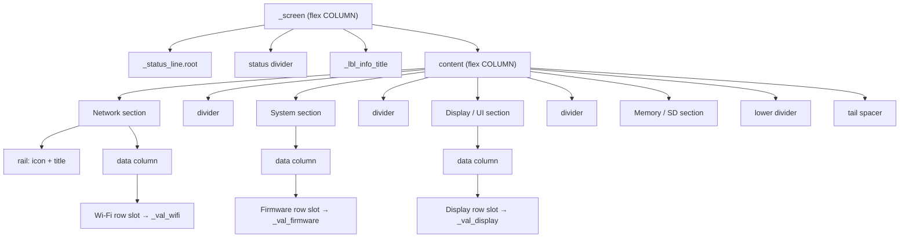

# Info screen — LVGL object tree (`scr_info`)

**Purpose / Назначение:**
**English:** Parent → child hierarchy for the Info carousel page (`LvglInfoPage`) created in `scr_info.cpp`. Covers status chrome, INFO title, four section-rail blocks (Network / System / Display·UI / Memory·SD), KV row variants, responsive rail geometry, runtime data sources, Wi-Fi sampling cache, update pipeline, theme reapply walk, and PageChain lifecycle. Use when reasoning about layout contracts, theme-tree classification, or localization constant placement.
**Русский:** Иерархия родитель → потомок для страницы Info (`LvglInfoPage`) из `scr_info.cpp`: status chrome, заголовок INFO, четыре section-rail блока (Network / System / Display·UI / Memory·SD), варианты KV строк, адаптивная геометрия rail, источники runtime-данных, кэш сэмплирования Wi-Fi, конвейер update, обход темы и lifecycle PageChain. Удобно при анализе контрактов разметки, классификации дерева темы или размещения l10n-констант.

**Source of truth:**
`scr_info.cpp`:
- `LvglInfoPage::create()` — orchestration skeleton
- Private static builders: `create_status_chrome`, `create_title`, `create_content`
- Layout factories: `add_section_rail_block`, `add_kv_row`, `add_thin_divider`
- Theme walk: `info_reapply_tree_colors`
- Update: `LvglInfoPage::update()` (INFOREF-A does not refactor this pipeline)

**Maintenance / Поддержка:**
After any of the following, refresh the ASCII tree, Mermaid diagram, and relevant pipeline sections:
- hierarchy or parent-child relations change;
- section order or KV row variant assignment changes;
- responsive rail width / inset constants change;
- theme-tree classification rules (font / parent / flow) change;
- Wi-Fi sampling period or cache lifecycle changes;
- localization constant blocks (`kStr*` / `kFmt*`) change.
**После** изменения иерархии, порядка секций, responsive-констант, правил классификации темы, сэмплирования Wi-Fi или l10n-блоков — обновлять ASCII, Mermaid и соответствующие pipeline-разделы.

---

## Order on `_screen`

`_screen` is a flex **COLUMN** (top → bottom).

- `pad_all = LV_ACTIVE_PROFILE.frame_padding`
- `pad_row = kRootRowGap` (6 px)
- `bg_color = pal.device_background`
- not scrollable

**Creation order (load-bearing — do not reorder):**

1. `_status_line.root` — `wgt_status_line::create` inside `create_status_chrome`
2. status divider — `add_thin_divider` inside `create_status_chrome` (only if status line succeeded)
3. `_lbl_info_title` — `create_title`
4. `content` — `create_content` (local handle, not stored as member)

After creation: `installCarouselGesturesOnPageRoot(_screen)`.

---

## Tree (ASCII)

```
_screen  (flex COLUMN; pad_all=frame_pad; pad_row=6; not scrollable)
│
├── _status_line.root              wgt_status_line widget (clock / Wi-Fi / weather glance)
│
├── status divider                 1 px; height=kDividerHeight; bg=pal.divider
│
├── _lbl_info_title                "INFO"; font=kFontInfoTitle; text_primary; left-aligned
│
└── content                        flex COLUMN; flex_grow=1; pad_row=10; pad_bottom=frame_pad
    │
    ├── Network section            flex ROW; pad_column=8
    │   ├── rail                   flex COLUMN; responsive width + left inset
    │   │   ├── icon label         kIconNetwork; font=kFontSectionIcon; CLIP
    │   │   └── section title      kStrSectionNetwork; font_normal; WRAP
    │   └── data column            flex_grow=1; pad_left=5; pad_row=2
    │       ├── SSID row           CLIP value → _val_ssid
    │       ├── IP row             CLIP value → _val_ip
    │       ├── Wi-Fi row          ScrollCircular slot → _val_wifi
    │       └── MAC row            CLIP value → _val_mac
    │
    ├── divider                    1 px thin divider
    │
    ├── System section
    │   ├── rail                   kIconSystem + kStrSectionSystem
    │   └── data column
    │       ├── Firmware row       ScrollCircular slot → _val_firmware
    │       ├── Build row          CLIP → _val_build
    │       ├── Chip row           CLIP → _val_chip
    │       ├── CPU row            CLIP → _val_cpu
    │       └── Uptime row         CLIP → _val_uptime
    │
    ├── divider
    │
    ├── Display / UI section
    │   ├── rail                   kIconDisplay + kStrSectionDisplay
    │   └── data column
    │       ├── Display row        ScrollCircular slot → _val_display
    │       └── LVGL row           CLIP → _val_lvgl
    │
    ├── divider
    │
    ├── Memory / SD section
    │   ├── rail                   kIconMemory + kStrSectionMemory
    │   └── data column
    │       ├── Heap row           CLIP → _val_heap
    │       ├── PSRAM row          CLIP → _val_psram
    │       └── SD row             CLIP → _val_sd
    │
    ├── lower divider
    │
    └── tail spacer                flex_grow=1; min_height=0; transparent
```

---

## Diagram (Mermaid)



---

## Section rail structure

Each section is built by `add_section_rail_block(content, kStrSection*, kIcon*, pal)`:

```
section (flex ROW, pad_column=8)
├── rail (flex COLUMN, responsive width, left inset, pad_row=2)
│   ├── icon label   — kFontSectionIcon, CLIP, text_secondary
│   └── title label  — font_normal, WRAP, text_secondary
└── data column (flex_grow=1, pad_left=kDataColumnInset, pad_row=2)
    └── KV rows via add_kv_row(...)
```

Rail width and left inset depend on `LV_ACTIVE_PROFILE.width` vs `kCompactWidthMax` (360 px). The rail itself is not stored as a class member; theme recoloring uses the tree walk.

---

## KV row variants

**Clip row** (default `InfoKvValueLongMode::Clip`):

```
row (flex ROW, pad_column=10)
├── key label   — width 34%, font_normal, text_secondary, WRAP
└── value label — flex_grow=1, CLIP, font_normal, text_primary
```

**Circular row** (`InfoKvValueLongMode::ScrollCircular` — only for `_val_wifi`, `_val_firmware`, `_val_display`):

```
row (flex ROW)
├── key label
└── slot (flex_grow=1, transparent)
    └── value label — width 100%, SCROLL_CIRCULAR
```

The slot wrapper bounds circular scroll without affecting row or data-column dimensions. No extra wrapper is used for Clip values.

---

## Layout and responsive geometry

| Constant | Value | Usage |
|----------|-------|-------|
| `kRootRowGap` | 6 px | `_screen` flex row gap |
| `kContentRowGap` | 10 px | `content` flex row gap between sections |
| `kDividerHeight` | 1 px | all thin dividers |
| `kDataColumnInset` | 5 px | data column left padding |
| `kCompactWidthMax` | 360 px | compact vs wide breakpoint |
| `kRailWidthCompactPct` | 24% | rail width when W ≤ 360 |
| `kRailWidthWidePct` | 22% | rail width when W > 360 |
| `kRailInsetCompact` | 6 px | rail left inset when W ≤ 360 |
| `kRailInsetWide` | 10 px | rail left inset when W > 360 |
| `kKvKeyWidthPct` | 34% | key label width in KV row |

---

## Initial render contract

After `create()` completes successfully:

- all 14 value labels contain `kStrPlaceholder` (`"--"`);
- circular value labels (`_val_wifi`, `_val_firmware`, `_val_display`) already have `LV_LABEL_LONG_SCROLL_CIRCULAR` and width `100%` of their slot;
- clip value labels have `LV_LABEL_LONG_CLIP` and `flex_grow=1`;
- no label contains empty or garbage text;
- first `update()` fills live values — `enter()` is not required for primary render.

---

## Runtime data sources

| Row | Source |
|-----|--------|
| SSID | `WiFi.SSID()` when connected; else placeholder |
| IP | `WiFi.localIP()` when connected; else placeholder |
| Wi-Fi | RSSI + channel + state (see Network sampling) |
| MAC | `WiFi.macAddress()` |
| Firmware | `YOVERSION` macro |
| Build | translation-unit `k_info_build_stamp` (`__DATE__` / `__TIME__`) |
| Chip | `ESP.getChipModel()` + `ESP.getChipRevision()` |
| CPU | `ESP.getCpuFreqMHz()` + `ESP.getChipCores()` |
| Uptime | `millis()` → HH:MM:SS |
| Display | compile-time `DSP_MODEL` via `info_format_display_product_line()` |
| LVGL | `LVGL_VERSION_MAJOR/MINOR/PATCH` |
| Heap | `ESP.getFreeHeap()` → MB or KB |
| PSRAM | `ESP.getFreePsram()` / `ESP.getPsramSize()` |
| SD | compile-time `SDC_CS` + `config.getMode()` |

Hardware identifiers in the Display row (`ST7701`, `AXS15231B`, etc.) are compile-time product strings, not l10n user text.

---

## Network sampling and cache

- RSSI and primary channel are sampled at most once every `kWifiSamplePeriodMs` (3000 ms) while Wi-Fi is connected.
- Cache lives in **static locals inside `update()`**: `s_wifi_sample_ms`, `s_rssi_cached`, `s_ch_cached`, `s_wifi_was_connected`.
- On connect/disconnect transition, `s_wifi_sample_ms` is reset to force an immediate resample.
- Cache **survives PageChain auto-delete** (page object tree freed, static locals remain).
- **INFOREF-A does not change** this behavior; moving cache to page members is deferred to **INFOREF-B**.
- Page `update()` is invoked nominally once per second (throttled in `display.cpp`), but this is not a strict 1 Hz guarantee.

---

## Update pipeline

`LvglInfoPage::update()` (single method — not split in INFOREF-A):

1. Guard: require `_screen`, `_status_line.root`, `_val_ssid`.
2. `wgt_status_line::update(_status_line)`.
3. Network block: Wi-Fi cache sampling + SSID / IP / Wi-Fi / MAC labels via `info_set_text_if_changed`.
4. System block: firmware, build stamp, chip, CPU, uptime.
5. Display block: static `s_display_line` (initialized once), LVGL version.
6. Memory block: heap, PSRAM, SD status.

All runtime label updates use `info_set_text_if_changed()` — no direct repeated `lv_label_set_text()` in update.

---

## Theme reapply pipeline

`liveReapplyTheme()`:

1. `_screen` background → `pal.device_background`
2. `wgt_status_line::reapplyTheme(_status_line)`
3. `_lbl_info_title` → `pal.text_primary`
4. `info_reapply_tree_colors(_screen, pal, _status_line.root)` — recursive walk, skipping status-line subtree

**Classification rules** (must match object tree from factories):

| Object | Rule |
|--------|------|
| label, font == `kFontSectionIcon` | section icon → `text_secondary` |
| label, first child of ROW parent | key label → `text_secondary` |
| label, child of COLUMN parent | section title → `text_secondary` |
| other labels | value labels → `text_primary` |
| object, height==1, bg OPA_COVER | divider → `pal.divider` |

No additional handles are stored solely for theme recoloring.

---

## PageChain lifecycle

| Event | Behavior |
|-------|----------|
| `create()` | builds full tree; stores 14 value-label handles + title + status line |
| `enter()` | no-op |
| `update()` | refreshes value labels from runtime sources |
| `exit()` | no-op |
| `liveReapplyTheme()` | recolors without rebuild |
| `destroy()` | `lv_obj_del(_screen)` + `_nullHandles()` |
| `releaseAfterAutoDelete()` | LVGL tree already freed by PageChain; `_nullHandles()` only — **never** `lv_obj_del` |

`_nullHandles()` clears `_screen`, `_status_line`, `_lbl_info_title`, and all `_val_*` pointers. Wi-Fi static cache in `update()` is **not** cleared on auto-delete (INFOREF-B scope).

**Allocation failure:** if `wgt_status_line::create` fails (`_status_line.root == nullptr`), `create()` deletes `_screen` and returns. Other partial failures leave whatever objects were created (existing contract — no new rollback added in INFOREF-A).

---

## Localization readiness

Static user-facing labels and UI format strings are centralized in the `kStr*` / `kFmt*` sections at the top of `scr_info.cpp` as preparation for future localization.

INFOREF-A does not introduce runtime localization, language tables, locale switching, or dynamic string allocation.

Статические пользовательские подписи и форматные строки UI собраны в секциях `kStr*` / `kFmt*` в начале `scr_info.cpp` как подготовка к будущей локализации.

INFOREF-A не вводит runtime-локализацию, языковые таблицы, переключение locale или динамическое выделение строк.

Icon glyphs (`kIcon*`) are UTF-8 codepoints, not translatable strings.

---

## Notes / Заметки

- INFOREF-A split: structural/layout refactor only; `update()` pipeline refactor deferred to INFOREF-B.
- Section containers, rails, dividers, and tail spacer are **local** to `create_content()` — only value-label handles and title/status chrome are class members.
- `info_format_display_product_line()` uses hardware product identifiers — intentionally outside `kStr*`.
- Two separate `millis()` calls in `update()` (Wi-Fi sampling and uptime) are preserved by design in INFOREF-A.
