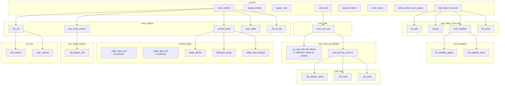

# Main screen — LVGL object tree (`scr_main`)

**English:** Parent → child hierarchy for `LvglMainScreen::create()` in `scr_main.cpp`. Use when reasoning about layout, flex, and theme padding.  
**Русский:** Иерархия родитель → потомок для `LvglMainScreen::create()` в `scr_main.cpp`. Удобно для разметки, flex и паддингов темы.

**Source of truth:** `[scr_main.cpp](scr_main.cpp)` — update this file when the tree changes.

**Maintenance / Поддержка:** After editing `create()` (new containers, reorder, rename), refresh the ASCII block and the Mermaid block below so they stay accurate.

---

## Order on `_screen` (flex column, top → bottom)

**Z-order (bottom → top):** `_bg_img` (6.1F-b) — optional file-backed background; then `_bg_scrim` (F-c) — optional very light black scrim **only for `ThemePreset::Dark`** when bg file exists; both `FLOATING`, not flex children.

1. `wgt_status_line.root`  
2. `status_divider`
3. `spacer_top` (flex grow; Mode A: **1** / Mode B: **1** — paired with `spacer_bottom` **5** to lift `cont_mid` higher)
4. `cont_mid` (outer COLUMN wrapper — 6.1E-visual)
5. `spacer_bottom` (flex grow; Mode A: **1** / Mode B: **5**)
6. `zone_visual` (1 px placeholder)
7. `zone_bottom_sym_spacer` (symmetry, height may be set after layout)
8. `zone_bottom`

Floating overlays (not flex children of `_screen` in the same sense): `_lbl_vol_popup`; `_vol_touch_zone` / `_vol_gesture_guard` inside `zone_bottom`; `_screen_bottom_carousel_guard` if needed.

---

## Tree (ASCII)

```
_screen
├── _bg_img  (optional LVGL .bin from LittleFS; FLOATING — under all content; 6.1F-b)
├── _bg_scrim  (optional black LV_OPA_50; FLOATING; only Dark + bg present; F-c)
├── wgt_status_line.root  (see ../widgets/wgt_status_line.cpp)
│   ├── lbl_wifi
│   ├── spacer (flex grow)
│   ├── cont_weather
│   │   ├── lbl_weather_glyph
│   │   └── lbl_weather_temp
│   └── lbl_clock
├── status_divider
├── spacer_top
├── cont_mid  (COLUMN wrapper; 6.1E-visual)
│   └── cont_mid_row  (ROW; art_slot + cont_text; 6.1E-visual)
│       ├── _art_slot  (120×120; LV_OBJ_FLAG_HIDDEN when no art file — Mode A; visible when station art present — Mode B)
│       │   └── _art_img  (lv_img; L:/logo/<normalized_key>.bin — TRUE_COLOR_ALPHA CF=5, 120×120)
│       └── cont_text  (flex_grow=1; Mode A: CENTER flex + LV_TEXT_ALIGN_CENTER; Mode B: START flex + LV_TEXT_ALIGN_LEFT)
│           ├── _lbl_station_name
│           ├── _lbl_track
│           └── _lbl_artist
├── spacer_bottom
├── zone_visual
├── zone_bottom_sym_spacer
├── zone_bottom
│   ├── control_band (shared shelf underlay; flex row; chrome colors = pal.main_chrome_* tokens — 6.6R-GA)
│   │   ├── _edge_glow_top (FLOATING; rim highlight top edge, not in flex; gradient stops from pal.main_chrome_glow_top — 6.6R-GA)
│   │   ├── _edge_glow_bot (FLOATING; rim highlight bottom edge, not in flex; gradient stops from pal.main_chrome_glow_bottom — 6.6R-GA)
│   │   ├── utility_left (list; width balanced with utility_right — centers transport triad)
│   │   │   └── list — lv_btn, text_secondary (transport-sized); routing TBD
│   │   ├── transport_group (LV_OBJ_FLAG_OVERFLOW_VISIBLE; pad_hor inset; flex_grow)
│   │   │   └── prev / play-stop / next — lv_btn + transport callbacks; play/stop label synced from player.status()
│   │   └── utility_right (settings; same balanced width as utility_left)
│   │       └── settings — lv_btn, text_secondary (transport-sized); routing TBD
│   ├── row_meta_stream
│   │   └── _lbl_stream_info  (compact: #N • 44.1/16 • 256k • CODEC; SR/bits only if both known; U+2022 sep)
│   ├── col_vol
│   │   ├── _lbl_volume
│   │   └── _bar_volume
│   ├── _bar_buffer (heap / divider line)
│   ├── _lbl_ai_line
│   ├── _vol_touch_zone (FLOATING)
│   └── _vol_gesture_guard (FLOATING)
├── _screen_bottom_carousel_guard (FLOATING, if gap)
└── _lbl_vol_popup (FLOATING)
```

---

## Diagram (Mermaid)

Render in GitHub / VS Code Markdown preview / Mermaid-compatible tools.




---

## Notes / Заметки

- **Control band (Stage 6.1E+):** Three flex children: `utility_left` (list) + `transport_group` (flex_grow) + `utility_right` (settings). Left/right slot widths are equalized after layout (`LV_MAX`) so the transport triad stays centered; horizontal inset from shelf edge is `control_band` `pad_hor` for both wings. List/settings use the **same** icon font and `pad`/`min` hit size as transport; color `text_secondary` and softer pressed opa (utility) as before.  
**Полоса управления:** list + транспорт + settings; боковые слоты выровнены; list/settings — размер как транспорт, цвет/pressed как раньше (secondary + тише).
- **Theme padding:** Base `lv_obj` containers may inherit LVGL default `card` padding; Main zeroes explicit `pad_all` where needed — see comments in `scr_main.cpp` and `wgt_status_line.cpp`.  
**Паддинг темы:** у базового `lv_obj` может быть `card` padding; на Main явно обнуляем `pad_all` там, где нужно — см. комментарии в `scr_main.cpp` и `wgt_status_line.cpp`.
- **Main chrome tokens (Stage 6.6R-GA):** shelf body/border, art frame, rim glow stops, and control-button pressed bg are now palette tokens (`pal.main_chrome_bg`, `main_chrome_border`, `main_chrome_glow_top`, `main_chrome_glow_bottom`, `main_chrome_pressed_bg`) instead of hardcoded colors. `_edge_glow_top` / `_edge_glow_bot` are stored as members so `liveReapplyTheme()` refreshes gradient stops on runtime theme switch (no stale glow). Geometry/opacity/radius stay local in `create()`.  
**Хром главного экрана (6.6R-GA):** тело/рамка полки, рамка арта, стопы glow и pressed-фон кнопок — теперь токены палитры; glow-объекты сохранены как члены и обновляются при смене темы (без «застрявшего» блика). Геометрия/прозрачность/радиус остаются локальными.
- Widget `wgt_status_line` is defined in `[../widgets/wgt_status_line.cpp](../widgets/wgt_status_line.cpp)`.

