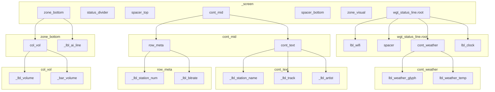

# Main screen — LVGL object tree (`scr_main`)

**English:** Parent → child hierarchy for `LvglMainScreen::create()` in `scr_main.cpp`. Use when reasoning about layout, flex, and theme padding.  
**Русский:** Иерархия родитель → потомок для `LvglMainScreen::create()` в `scr_main.cpp`. Удобно для разметки, flex и паддингов темы.

**Source of truth:** [`scr_main.cpp`](scr_main.cpp) — update this file when the tree changes.

**Maintenance / Поддержка:** After editing `create()` (new containers, reorder, rename), refresh the ASCII block and the Mermaid block below so they stay accurate.

---

## Order on `_screen` (flex column, top → bottom)

1. `wgt_status_line.root`  
2. `status_divider`  
3. `spacer_top` (flex grow)  
4. `cont_mid`  
5. `spacer_bottom` (flex grow)  
6. `zone_visual` (1 px placeholder)  
7. `zone_bottom`  
8. `_hit_play` — created last, **`LV_OBJ_FLAG_FLOATING`** (not a flex row; sits above center for tap)

---

## Tree (ASCII)

```
_screen
├── wgt_status_line.root  (see ../widgets/wgt_status_line.cpp)
│   ├── lbl_wifi
│   ├── spacer (flex grow)
│   ├── cont_weather
│   │   ├── lbl_weather_glyph
│   │   └── lbl_weather_temp
│   └── lbl_clock
├── status_divider
├── spacer_top
├── cont_mid
│   ├── cont_text
│   │   ├── _lbl_station_name
│   │   ├── _lbl_track
│   │   └── _lbl_artist
│   └── row_meta
│       ├── _lbl_station_num
│       └── _lbl_bitrate
├── spacer_bottom
├── zone_visual
├── zone_bottom
│   ├── col_vol
│   │   ├── _lbl_volume
│   │   └── _bar_volume
│   └── _lbl_ai_line
└── _hit_play   (FLOATING — вне flex-потока, поверх для тапа)
```

---

## Diagram (Mermaid)

Render in GitHub / VS Code Markdown preview / Mermaid-compatible tools.



---

## Notes / Заметки

- **Theme padding:** Base `lv_obj` containers may inherit LVGL default `card` padding; Main zeroes explicit `pad_all` where needed — see comments in `scr_main.cpp` and `wgt_status_line.cpp`.  
  **Паддинг темы:** у базового `lv_obj` может быть `card` padding; на Main явно обнуляем `pad_all` там, где нужно — см. комментарии в `scr_main.cpp` и `wgt_status_line.cpp`.

- Widget `wgt_status_line` is defined in [`../widgets/wgt_status_line.cpp`](../widgets/wgt_status_line.cpp).
