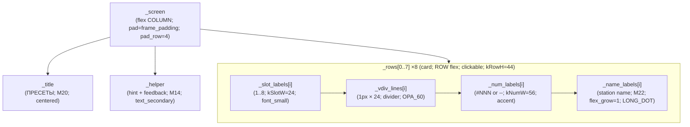

# Preset screen — LVGL object tree (`scr_preset`)

**Purpose / Назначение:**
**English:** Parent → child hierarchy for the Preset Temporary screen created by `LvglPresetScreen::create()` in `scr_preset.cpp`, plus the event and timer flow that drives interaction. Use when reasoning about card layout, column flex, slot state, feedback lifecycle, timeout/dismiss behavior, and theme retint.
**Русский:** Иерархия родитель → потомок для Preset Temporary Screen, создаваемого `LvglPresetScreen::create()` в `scr_preset.cpp`, а также поток событий и таймеров. Удобно для разметки карточек, колонок flex, состояния слотов, lifecycle feedback, таймаута/dismiss и retint темы.

**Source of truth:**
`scr_preset.cpp`: `LvglPresetScreen::create()` is the source of truth for the object tree.
Interaction flow is driven by `_rowEventCb`, `_onRow*` methods, `_feedback_timer`, and `_countdown_timer`.

**Maintenance / Поддержка:**
After any of the following, refresh the ASCII tree, the Mermaid block, and the interaction flow section:
- adding/removing a label or container inside a card row;
- changing card column widths (`kSlotW`, `kNumW`) or flex alignment;
- adding/removing a LVGL timer;
- changing dismiss / timeout semantics.

**После** добавления метки или контейнера, изменения ширин колонок, таймеров или семантики dismiss — обновлять ASCII, Mermaid и раздел interaction flow.

---

## Screen type and lifecycle

`LvglPresetScreen` has `screenType() == ScreenType::Temporary`.

It is **not** a carousel page — it is opened on top of the current carousel slot via `PageChain::showTemporary()` (triggered by a top-edge downward swipe detected in `poll_top_edge_swipe()`). On dismiss or timeout, `PageChain::dismissTemporary()` returns to the **origin carousel slot** that was active when the Preset was opened (not always Main).

Экран не является страницей карусели — он открывается поверх текущего слота через `PageChain::showTemporary()` (обнаружение жеста свайпа вниз от верхнего края в `poll_top_edge_swipe()`). При dismiss или таймауте возврат на **origin-слот карусели**, с которого был открыт Preset.

---

## Order on `_screen`

`_screen` is a flex **column** (top → bottom).
`pad_all = LV_ACTIVE_PROFILE.frame_padding`, `pad_row = kRowGap` (4 px).
Not scrollable. Not clickable (only child cards are).

1. `_title` — label `"ПРЕСЕТЫ"`; M20; `text_primary`; centered; `pad_top=2`, `pad_bottom=8`
2. `_rows[0]` — card row (clickable; `kRowH=44 px`; rounded `kRowRadius=8`; border `kRowBorder=1`)
3. `_rows[1]` … `_rows[7]` — identical card rows
4. `_helper` — label (hint + feedback target); M14; `text_secondary`; centered; `pad_top=4`

**9 flex gaps × 4 px = 36 px** total gap between 10 flex items (title + 8 rows + helper).

---

## Tree (ASCII)

```
_screen
├── _title                     ("ПРЕСЕТЫ"; M20; text_primary; LV_TEXT_ALIGN_CENTER)
├── _rows[0]                   (card; ROW flex; clickable; rounded; border; kRowH=44)
│   ├── _slot_labels[0]        ("1"; kSlotW=24 px; font_small; text_secondary; centered)
│   ├── _vdiv_lines[0]         (1 px × kDivH=24 px; bg=divider; OPA_60; not clickable)
│   ├── _num_labels[0]         ("#NNN" or "--"; kNumW=56 px; font_normal; accent/accent_soft/text_meta)
│   └── _name_labels[0]        (station name; flex_grow=1; width=1px base; M22; LONG_DOT; text_primary/secondary)
├── _rows[1]                   (same children as [0], slot index 1)
├── _rows[2]                   (same children as [0], slot index 2)
├── _rows[3]                   (same children as [0], slot index 3)
├── _rows[4]                   (same children as [0], slot index 4)
├── _rows[5]                   (same children as [0], slot index 5)
├── _rows[6]                   (same children as [0], slot index 6)
├── _rows[7]                   (same children as [0], slot index 7)
└── _helper                    (hint + feedback; M14; text_secondary/accent; LV_TEXT_ALIGN_CENTER)
```

**No local (non-member) containers** — all LVGL objects created in `create()` are either stored as members or are leaf labels with no children.

---

## Mermaid diagram



---

## Card column layout (per row, left → right)

Available content width on 480 px screen:
`480 − 2×8 (scr pad) − 2×8 (row pad LR) − kSlotW(24) − 1(div) − kNumW(56) − 3×kRowColGap(4) = **355 px** for station name`.

| Column | Member | Width | Font | Color role |
|---|---|---|---|---|
| Slot № | `_slot_labels[i]` | `kSlotW = 24 px` | `font_small` | `text_secondary` |
| Divider | `_vdiv_lines[i]` | `1 px` | — | `divider` at OPA_60 |
| Station № | `_num_labels[i]` | `kNumW = 56 px` | `font_normal` | `accent` / `accent_soft` / `text_meta` |
| Station name | `_name_labels[i]` | `flex_grow=1` (base=1 px) | M22 | `text_primary` / `text_secondary` |

**Why `width=1` + `flex_grow=1` for `_name_labels`:** LVGL flex uses the base width as the *minimum*. `LV_SIZE_CONTENT` as base would set the minimum to the full text width, preventing `LV_LABEL_LONG_DOT` from truncating. Using `1 px` base lets flex distribute all remaining space and LONG_DOT truncates correctly at the flex boundary.

**Почему `width=1` + `flex_grow=1`:** база `LV_SIZE_CONTENT` задаёт минимум = полная ширина текста, что мешает LONG_DOT обрезать. База `1 px` позволяет flex отдать всё оставшееся место и LONG_DOT работает корректно.

---

## Slot visible states

For each `_rows[i]`:

| Condition | `_num_labels` text | color | `_name_labels` text | color |
|---|---|---|---|---|
| Empty (not occupied) | `"--"` | `text_meta` | `kStrEmpty` = `"Пусто"` | `text_secondary` |
| Occupied, station not in list | `"#NNN"` | `accent_soft` | `kStrUnavailable` = `"Недоступно"` | `text_secondary` |
| Occupied, station valid | `"#NNN"` | `accent` | `" • <station name>"` | `text_primary` |

**Row pressed state:** `list_row_selected_bg` background + `accent_soft` border (LVGL state style).

---

## Interaction flow (event + timer)

```
[Top-edge swipe gesture]
        ↓
poll_top_edge_swipe() in lvgl_ui.cpp
        ↓
PageChain::showTemporary(&s_preset_screen, kPresetTimeoutMs=15000)
        ↓
LvglPresetScreen::enter()
  ├── preset_store::begin()
  ├── _setHelperDefault()  →  _updateCountdownHelper()  →  _helper text = kStrCountdownFmt(15)
  ├── _startCountdownTimer()  (recurring kCountdownPeriodMs=333 ms)
  └── _updateRowContent(0..7)

[Each ~333 ms — _countdownTimerCb]
        ↓
_updateCountdownHelper()
  └── if second changed → _helper text = kStrCountdownFmt(remaining)

[Tap on card (SHORT_CLICKED)]
        ↓
_onRowShortClicked(slot)
  ├── if occupied && valid → play_station(num) → dismissActiveTemporary()
  └── else → no-op

[Long press on card (LONG_PRESSED)]
        ↓
_onRowLongPressed(slot)
  ├── refreshActiveTemporaryTimeout()   (resets 15s timer)
  ├── if saveCurrentStation(slot) OK:
  │     _updateRowContent(slot)
  │     _setHelperMessage(kStrSavedFmt, success=true)
  │     _scheduleHelperRestore(kHelperRestoreMsSuccess=800ms)
  └── else:
        _setHelperMessage(kStrNoStation | kStrSaveFailed, success=false)
        _scheduleHelperRestore(kHelperRestoreMsError=1200ms)

[_feedbackTimerCb fires after restore delay]
        ↓
_setHelperDefault()  →  _updateCountdownHelper()   (countdown resumes)

[PageChain::tick() — timeout or dismissActiveTemporary()]
        ↓
LvglPresetScreen::exit()
  ├── _cancelFeedbackTimer()
  └── _cancelCountdownTimer()
        ↓
PageChain returns to origin carousel slot (or Main as fallback)
        ↓
LvglPresetScreen::destroy()
  └── lv_obj_del(_screen) + _nullHandles()
```

Invariants:
- **One `preset_store::begin()`** per `enter()` — data is loaded once, not re-read in `update()`.
- `update()` is a **no-op** — all content refreshes are timer-driven or event-driven.
- The **countdown timer** is a recurring LVGL timer (not a FreeRTOS task); it only runs while the screen is active and is cancelled in `exit()`.
- The **feedback timer** is one-shot; `_feedbackActive=true` pauses countdown display while feedback is visible.
- `refreshActiveTemporaryTimeout()` resets `PageChain::_tempStartMillis` — called on PRESSED, LONG_PRESSED, RELEASED to prevent auto-dismiss while the user is interacting.

---

## Helper label states

| State | Text | Color |
|---|---|---|
| Countdown (default) | `"УДЕРЖИТЕ ДЛЯ СОХРАНЕНИЯ • ВОЗВРАТ NNС"` | `text_secondary` |
| Save success | `"ПРЕСЕТ N СОХРАНЕН"` | `accent` |
| No station | `"НЕТ СТАНЦИИ ДЛЯ СОХРАНЕНИЯ"` | `text_secondary` |
| Save failed | `"ОШИБКА СОХРАНЕНИЯ"` | `text_secondary` |

Countdown shows seconds rounded up: `"15С"` just after open, `"1С"` is the last displayed value before auto-dismiss.

---

## Theme behavior (`liveReapplyTheme`)

`liveReapplyTheme()` calls `_applyAllColors()` which:
- Retints `_screen` background (`device_background`).
- Retints `_title` (`text_primary`) and `_helper` (`text_secondary`).
- Calls `_applyRowColors(slot, pal)` for each slot, which applies:
  - `panel_background` / `panel_border` to card (+ pressed-state styles).
  - `divider` to `_vdiv_lines`.
  - `text_secondary` to `_slot_labels`.
  - `accent` / `accent_soft` / `text_meta` to `_num_labels` based on slot state.
  - `text_primary` / `text_secondary` to `_name_labels` based on slot state.

The **render cache is not applicable** — there is no differential render; `enter()` always builds all rows from scratch, and `liveReapplyTheme()` repaints all colors in one pass.

---

## Lifecycle summary

- `create()` — builds the full object tree (title + 8 card rows + helper). No initial `update()` and no timer start here.
- `enter()` — loads preset data, sets helper, starts countdown timer, rebuilds all 8 rows.
- `update()` — **no-op** (empty body). Content is kept current by LVGL timers and event callbacks.
- `exit()` — cancels both LVGL timers. LVGL tree is not yet deleted here.
- `destroy()` — deletes the LVGL tree (`lv_obj_del`) and nulls all member handles via `_nullHandles()`.
- `liveReapplyTheme()` — repaints all colors in one pass; does not rebuild text or re-read preset data.
- `PageChain` calls `destroy()` explicitly after `exit()` (Temporary lifecycle); there is **no PageChain auto-delete** for Temporary screens (they are not carousel pages).

---

## Notes / Заметки

```
PRESETREF-A:
create() is organized top-to-bottom: title → 8 card rows → helper.
No layout builders were extracted (screen is simple enough for one create()).
Anonymous namespace has 4 sections: UI strings → visual constants → layout geometry → helpers.
All user-visible strings are in the UI strings block (l10n readiness).
```

- **PRESETREF-A:** `scr_preset.cpp` follows the same structural pattern as `scr_weather.cpp` (WEATHERREF-A): all user-visible string literals are gathered into the `kStr*` block at the top of the anonymous namespace for future localization migration to `displayL10n_*.h`. String values are in Russian; constant names stay in English.
  **PRESETREF-A:** `scr_preset.cpp` следует тому же шаблону, что и `scr_weather.cpp` (WEATHERREF-A): все видимые строки — в блоке `kStr*`; значения на русском, имена констант на английском.
- **No `installCarouselGesturesOnPageRoot`** — Preset is a Temporary, not a carousel page; it does not register carousel gesture callbacks on its `_screen`.
- All `lv_*` calls are on **DspTask only** (via `lvgl_ui::taskHandler` → `poll_top_edge_swipe` → event callbacks → LVGL timers).
- `style_transp()` is defined in the anonymous namespace for potential future use; it is not called in the current implementation.
