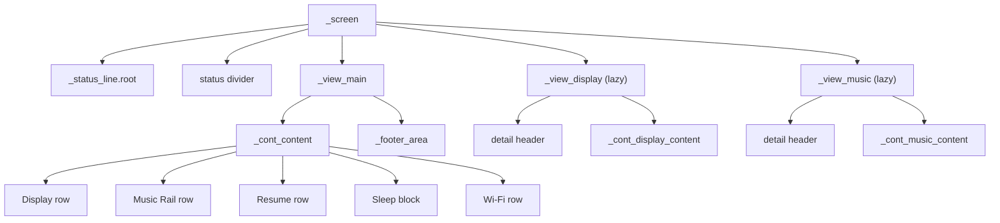

Author: Witaliy76 - https://github.com/Witaliy76

# Settings screen — LVGL object tree (`scr_settings`)

**Purpose / Назначение:**
**English:** Parent → child hierarchy for the Settings carousel page (`LvglSettingsPage`) in `scr_settings.cpp`. Covers Main category rows, lazy Display detail (MEM1), lazy Music Rail detail (destroy-on-Back), sleep-device overlay, footer, view switching, carousel gesture blocking, and l10n constant inventory. Use when reasoning about layout contracts, lazy view lifecycle, or SETTINGSREF-A maintenance.
**Русский:** Иерархия родитель → потомок для страницы Settings (`LvglSettingsPage`) из `scr_settings.cpp`: главный вид с категориями, lazy Display detail (MEM1), lazy Music Rail (destroy-on-Back), оверлей Sleep Device, футер, переключение видов, блокировка swipe карусели и инвентарь l10n-констант.

**Source of truth:**
`scr_settings.cpp`:
- `LvglSettingsPage::create()` — orchestration skeleton
- Private static builders: `create_main_structure`, `populate_main_rows`, `build_display_detail`, `build_music_rail_detail`
- Lazy wrappers: `_ensureDisplayView`, `_ensureMusicRailView` / `_destroyMusicRailView`
- View router: `_showView`, sync helpers `_syncMainRowValues`, `_syncDisplayValues`, `_syncMusicRailValues`
- Overlay: `_showSleepDeviceWarning`, `_hideSleepDeviceWarning`

**Maintenance / Поддержка:**
After hierarchy, lazy lifecycle, row order, overlay copy, or `kStr*` blocks change — refresh ASCII, Mermaid, view-switching table, and string inventory sections.

---

## Order on `_screen`

`_screen` is a flex **COLUMN** (top → bottom).

- `pad_all = LV_ACTIVE_PROFILE.frame_padding`
- `pad_row = kRootRowGap` (6 px)
- `bg_color = pal.device_background`
- not scrollable

**Creation order (load-bearing — do not reorder):**

1. `_status_line.root` — `wgt_status_line::create`
2. status divider — `add_bottom_divider`
3. `_view_main` + `_cont_content` — `create_main_structure`
4. Main category rows — `populate_main_rows`
5. `_footer_area` + `_lbl_footer` — `create_footer` (inside `_view_main`)

After creation: `installCarouselGesturesOnPageRoot(_screen)`.

**Not created in `create()` (lazy):**

- `_view_display` + Display detail — first tap on Display row → `_ensureDisplayView` → `build_display_detail`
- `_view_music` + Music Rail detail — first tap on Music Rail row → `_ensureMusicRailView` → `build_music_rail_detail`
- `_sleep_device_overlay` — runtime on Sleep Device action confirm path

---

## Tree (ASCII) — Main view (default)

```
_screen  (flex COLUMN; pad_all=frame_pad; pad_row=6; not scrollable)
│
├── _status_line.root              wgt_status_line (clock / Wi-Fi / weather glance)
│
├── status divider                 1 px; bg=pal.divider
│
└── _view_main                     flex COLUMN; flex_grow=1; visible by default
    │
    ├── _cont_content              flex COLUMN; flex_grow=1; pad_top=8; pad_bottom=4
    │   │
    │   ├── display row unit       create_row_unit + fill_category_row → _row_display
    │   │   └── [icon | DISPLAY | brightness% | chevron] + divider
    │   │
    │   ├── music row unit         → _row_music
    │   │   └── [icon | MUSIC RAIL | ON/OFF | chevron] + divider
    │   │
    │   ├── resume row unit        → _row_resume_startup
    │   │   └── [icon | RESUME ON STARTUP | ON/OFF] + divider
    │   │
    │   ├── sleep block unit       add_sleep_block_unit → _row_sleep, _row_sleep_sub
    │   │   └── block (88 px)
    │   │       ├── icon (sleep glyph)
    │   │       └── text_col
    │   │           ├── line_main (tap → duration cycle) → _row_sleep.label/value
    │   │           └── line_sub  (tap → action cycle)   → _row_sleep_sub.label/value
    │   │       + divider
    │   │
    │   └── wifi row unit          → _row_wifi
    │       └── [icon | WI-FI | SSID / NOT CONNECTED | chevron] + divider
    │
    └── _footer_area               tappable; RETURN TO MAIN pill → _lbl_footer
```

---

## Tree (ASCII) — Display detail (lazy, MEM1)

Created as sibling of `_view_main` under `_screen`. Hidden until Display row tap.

```
_view_display  (flex COLUMN; flex_grow=1; HIDDEN until enter Display)
│
├── detail header                  create_detail_header
│   ├── _display_back_hit          back chevron tap → Main
│   ├── _display_header_icon       DISPLAY glyph
│   └── _lbl_display_header        "DISPLAY"
│
└── _cont_display_content        flex COLUMN; flex_grow=1; pad_top=8
    │
    ├── brightness_unit            (#ifdef ENABLE_BRIGHTNESS_CONTROL)
    │   └── brightness_block
    │       ├── _lbl_brightness_title   "BRIGHTNESS"
    │       └── slider_row
    │           ├── _brightness_slider
    │           └── _lbl_brightness_value
    │   + divider
    │
    ├── autodim row                → _row_autodim (AUTO DIM ON/OFF)
    ├── dim after row              → _row_dim_after (timeout cycle)
    ├── dim level unit
    │   └── dim_level_block
    │       ├── _lbl_dim_level_title    "DIM LEVEL"
    │       └── slider_row
    │           ├── _dim_level_slider
    │           └── _lbl_dim_level_value
    ├── theme_gap                  kDisplayThemeSectionGap spacer
    └── theme row                  → _row_theme (THEME preset + chevron)

block_gesture_bubble_deep(_view_display) — blocks carousel horizontal swipe.
```

---

## Tree (ASCII) — Music Rail detail (lazy, destroy-on-Back)

```
_view_music  (flex COLUMN; flex_grow=1; HIDDEN; destroyed on Back)
│
├── detail header
│   ├── _music_back_hit
│   ├── _music_header_icon
│   └── _lbl_music_header          "MUSIC RAIL"
│
└── _cont_music_content
    ├── presence rail row          → _row_rail_enabled
    └── rail profile row           → _row_rail_profile (disabled styling when rail OFF)

block_gesture_bubble_deep(_view_music)
_applyMusicRailProfileRowTreatment after build
```

---

## Tree (ASCII) — Sleep device overlay (layer top)

```
_sleep_device_overlay  (lv_layer_top; full-screen scrim)
└── card (88% width)
    ├── title label                kStrValSleepDevice ("SLEEP DEVICE")
    ├── body label                 kStrSleepOverlayBody
    └── btn_row
        ├── CANCEL btn             kStrButtonCancel
        └── USE SLEEP DEVICE btn   kStrButtonUseSleepDevice
```

Gesture on overlay blocked via `sleepDeviceOverlayBlockGestureEvt`.

---

## View switching

| View | Visible root | Hidden siblings | Carousel swipe |
|------|--------------|-----------------|----------------|
| `SettingsView::Main` | `_view_main` | `_view_display`, `_view_music` | allowed |
| `SettingsView::Display` | `_view_display` | `_view_main`, `_view_music` | **blocked** (`isSettingsDetailBlockingCarousel`) |
| `SettingsView::MusicRail` | `_view_music` | `_view_main`, `_view_display` | **blocked** |

**Lifecycle notes:**
- Display detail: created once per Settings page lifecycle (MEM1); survives Back.
- Music Rail detail: `_destroyMusicRailView` on Back and on `exit()`.
- Overlay: `_hideSleepDeviceWarning` on cancel, confirm, and `exit()`.

---

## Diagram (Mermaid)



---

## String inventory (`kStr*`)

| Constant | Usage |
|----------|--------|
| `kStrDisplay` | Main row + Display header |
| `kStrMusicRail` | Main row + Music header |
| `kStrResumeOnStartup` | Main row |
| `kStrSleepTimer` / `kStrWhenTimerEnds` | Sleep block labels |
| `kStrWifi` | Main row |
| `kStrBrightness` / `kStrTheme` / `kStrAutoDim` / `kStrDimAfter` / `kStrDimLevel` | Display detail |
| `kStrPresenceRail` / `kStrRailProfile` | Music Rail detail |
| `kStrValOn` / `kStrValOff` | Toggle values |
| `kStrValStopRadio` / `kStrValSleepDevice` | Sleep action + overlay title |
| `kStrValNotConnected` | Wi-Fi default value |
| `kStrValDark` / `kStrValLight` / `kStrValCustom` | Theme preset |
| `kStrValFence` / `kStrValOscilloscope` | Rail profile |
| `kStrTimeout30Sec` … `kStrTimeout10Min` | Autodim timeout cycle |
| `kStrSleep15Min` … `kStrSleep2Hours` | Sleep duration cycle |
| `kStrFooterReturn` | Footer pill |
| `kStrSleepOverlayBody` / `kStrButtonCancel` / `kStrButtonUseSleepDevice` | Sleep device overlay |

Dynamic formatted values (not `kStr*`): brightness `%`, dim level `%`, live Wi-Fi SSID.

---

## Builder map (SETTINGSREF-A)

| Builder | Responsibility |
|---------|----------------|
| `create_main_structure` | `_view_main` + `_cont_content` shell |
| `populate_main_rows` | All Main view category/sleep/wifi rows |
| `build_display_detail` | `_cont_display_content` subtree only (caller owns `_view_display` shell + header) |
| `build_music_rail_detail` | `_cont_music_content` subtree only (caller owns `_view_music` shell + header) |

`create()` must remain orchestration-only — no inline row construction.
