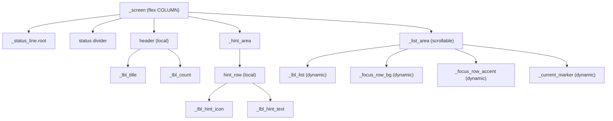

# Station screen — LVGL object tree (`scr_station`)

**Purpose / Назначение:**
**English:** Parent → child hierarchy for the Station carousel page (`LvglStationPage`) created in `scr_station.cpp`. Covers the static chrome (status line, divider, header, hint band), the scrollable list area, dynamic overlay objects (focus row, current-station marker), text-buffer ownership, focus vs. current station semantics, pointer/touch state machine, enter-scroll, theme reapply, and PageChain lifecycle. Use when reasoning about z-order, overlay lifecycle, tap routing, or localization resource placement.
**Русский:** Иерархия родитель → потомок для страницы Station (`LvglStationPage`) из `scr_station.cpp`: статический chrome (status line, разделитель, заголовок, hint band), прокручиваемая область списка, динамические overlay-объекты (фокусная строка, маркер текущей), владение буфером текста, семантика фокуса vs. текущей станции, state machine ввода, scroll при входе, reapply темы и lifecycle PageChain.

**Source of truth:**
`scr_station.cpp`:
- `LvglStationPage::create()` — orchestration skeleton
- Private static builders: `create_status_chrome`, `create_header`, `create_list_area`, `create_hint_band`
- `_populateStationList()` — list text, overlays
- `_layoutFocusChrome()`, `_layoutMarkerForCurrentStation()` — overlay geometry
- Pointer handlers: `_onListAreaPressed`, `_onListAreaPressing`, `_onListAreaReleased`, `_onListAreaShortClicked`

**Maintenance / Поддержка:**
After any of the following, refresh the ASCII tree, Mermaid diagram, and relevant pipeline sections:
- hierarchy or parent-child relations change;
- creation or sibling order changes;
- dynamic children set changes;
- overlay z-order or move_foreground/move_background calls change;
- station row geometry (pitch, pad, gutter) changes;
- text-buffer ownership or `lv_label_set_text_static` contract changes;
- pointer state-machine thresholds or semantics change;
- lifecycle reset semantics change;
- localization constant blocks (`kStr*` / `kFmt*`) change.
**После** изменения иерархии, порядка, dynamic children, z-order, геометрии строк, владения буфером, ввода или l10n-блоков — обновлять ASCII, Mermaid и соответствующие pipeline-разделы.

---

## Root order

`_screen` is a flex **COLUMN** (top → bottom).
- `pad_all = LV_ACTIVE_PROFILE.frame_padding`
- `pad_row = kRootRowGap` (8 px)
- `bg_color = pal.device_background`
- not scrollable

**Creation order (load-bearing — do not reorder):**

1. `_status_line.root` — `wgt_status_line::create` inside `create_status_chrome`
2. status divider — `add_thin_divider` inside `create_status_chrome`
3. `header` — `create_header` (local, not stored as member)
4. `_list_area` — `create_list_area`; `_populateStationList()` called immediately after in `create()`
5. `_hint_area` — `create_hint_band`
6. `installCarouselGesturesOnPageRoot(_screen)` — carousel gesture handler on `_screen`

---

## Static object tree

```
_screen  (flex COLUMN; pad_all=frame_pad; pad_row=8; not scrollable)
│
├── _status_line.root              wgt_status_line (clock / RSSI / weather glance)
│
├── status divider                 h=1; bg=pal.divider; OPA_COVER
│
├── header                         flex ROW; SPACE_BETWEEN; transparent; local (not stored)
│   ├── _lbl_title                 "STATIONS"; kFontTitle; text_primary
│   └── _lbl_count                 "-- / --"; kFontCount; text_secondary
│
├── _list_area                     flex_grow=1; scrollable VER; SCROLL_MOMENTUM; CLICKABLE;
│   │                              GESTURE_BUBBLE; pad_left=16; pad_top/bottom=8
│   └── (dynamic children — see next section)
│
└── _hint_area                     flex ROW; CENTER; panel_background@30%; border=divider; r=14
    └── hint_row                   flex ROW; transparent; pad_column=10; local (not stored)
        ├── _lbl_hint_icon         hand-click glyph; kFontHintIcon; text_secondary
        └── _lbl_hint_text         hint text; kFontHintText; CLIP; max_w; text_secondary
```

---

## Dynamic list-area children

`_list_area` children change on `_populateStationList()` (`lv_obj_clean` + recreate):

**Success path:**
```
_list_area
├── _lbl_list          CLIP; lv_label_set_text_static → _list_text; kFontStationList; line_space=16
├── _focus_row_bg      lv_obj; move_background; full-width highlight band; kFocusBgOpa
├── _focus_row_accent  lv_obj; left accent strip; w=3; h=29; kFocusAccentRadius
└── _current_marker    lv_label; speaker glyph; kFontCurrentMarker; kMarkerBoxW; CLIP; move_foreground
```

**Buffer allocation failure:**
```
_list_area
└── _lbl_list          "Station list buffer allocation failed" (kStrListBufferAllocFailed)
```
(No overlays. `_list_sig_cache_valid = false`.)

**List read failure:**
```
_list_area
├── _lbl_list          "Station list read failed\n" (kStrListReadFailed) via lv_label_set_text_static
├── _focus_row_bg      (created)
├── _focus_row_accent  (created)
└── _current_marker    (created if current station is valid)
```

---

## Diagram (Mermaid)



---

## Z-order and overlay invariants

After `_layoutFocusChrome()` + `_layoutMarkerForCurrentStation()` the z-order within `_list_area` (bottom → top) is:

```
_focus_row_bg      ← lv_obj_move_background()
_focus_row_accent  ← created after bg; remains between bg and label
_lbl_list          ← lv_obj_move_foreground() (called from both layout functions)
_current_marker    ← lv_obj_move_foreground()
```

**Invariants:**
- `_focus_row_bg` is always behind `_lbl_list` (text is readable).
- `_current_marker` is always in front of `_lbl_list`.
- `_lbl_list` is raised foreground every time overlays are updated — this is load-bearing.
- `liveReapplyTheme()` calls `_layoutFocusChrome()` which re-applies move_background / move_foreground, preserving z-order after theme switch.
- Overlays are positioned in **document coordinates** (relative to `_list_area` top-left, not viewport), so they scroll with the list.
- **Cleanup order (STATIONFIX-1):** Explicitly tracked overlays are deleted via `_destroyStationOverlays()` before `lv_obj_clean(_list_area)` so their stored handles cannot become dangling before explicit `lv_obj_del`. `lv_obj_clean` then removes remaining children (`_lbl_list`).

---

## Station row geometry

```
kStationListFontLineHeight = 25 px   M22 cap-height used for overlay math
kStationListLineSpace      = 16 px   LVGL line_space (gap below glyphs)
kStationLinePitch          = 41 px   row step = font_height + line_space

row Y (0-based) = (station_one_based - 1) × 41

kListPadLeft               = 16 px   _list_area left padding
kListPadTop                = kListPadBottom = 8 px

Left gutter (left to right):
  accent strip (3 px) | gap (5 px) | marker slot (32 px) | gap (5 px) | list text

_lbl_list pad_left = list_label_pad_left_for_marker_gutter()
                   = marker_left_x + kMarkerBoxW + kMarkerToNameGap
```

The `line_space` (16 px) is part of the station row pitch. Taps in the line-space below a station's glyph resolve to the same row index — this is correct behavior, not a bug.

---

## Header and count format

| Label | Initial text | Format |
|---|---|---|
| `_lbl_title` | `kStrStationsTitle` = `"STATIONS"` | static |
| `_lbl_count` | `kStrCountPlaceholder` = `"-- / --"` | updated by `_updateCountLabel()` |

Count formats:
- Valid current: `kFmtCountCurrentTotal` = `"%u / %u"`
- Unknown current: `kFmtCountUnknownTotal` = `"-- / %u"`
- No stations: `kStrCountPlaceholder`

---

## Hint band geometry

```
kHintBorderWidth = 1 px
kHintRadius = 14 px
kHintPadHorizontal = 16 px   left + right
kHintPadVertical = 10 px     top + bottom
kHintRowGap = 10 px          gap between icon and text in hint_row
kHintBgOpa = LV_OPA_30
```

Hint text: `kFmtHintBand` = `"%s%s%s"` → `kStrHintSwipe + kMetaFieldSepUtf8 + kStrHintTap`.
`kMetaFieldSepUtf8` = `" \xE2\x80\xA2 "` — same bullet U+2022 as `scr_main`.
Width capped at `LV_ACTIVE_PROFILE.width - 2×frame_padding - 32 - 20 - 40`, min `kHintMinTextWidth=80`.

---

## List text-buffer ownership

- `_list_text` is owned by `LvglStationPage`, allocated by `_ensureListTextBuffer()`.
- Allocation strategy: `ps_malloc` (PSRAM) first, `malloc` (heap) fallback.
- Normal label uses `lv_label_set_text_static` (`_createStationListLabelFromBuffer()`) — LVGL stores only the pointer, never copies.
- Allocation-error label uses `lv_label_set_text` (`_showStationListAllocationError()`) — LVGL makes its own copy; `_list_text` is not involved.
- Buffer **must stay alive** while `_lbl_list` (normal path) exists.
- On rebuild: `_clearStationListVisuals()` → overlays + `lv_obj_clean` (deletes `_lbl_list`) → buffer may be reallocated by `_ensureListTextBuffer()`.
- On `destroy()`: `lv_obj_del(_screen)` (deletes `_lbl_list`) → `_nullHandles()` → `_releaseListTextBuffer()` → `free(_list_text)`.
- On `releaseAfterAutoDelete()`: PageChain already freed tree (including `_lbl_list`) → `_nullHandles()` → `_releaseListTextBuffer()`.
- Signature cache updated after successful normal populate; invalidated on buffer allocation failure.

---

## List population pipeline

```
_populateStationList()
    │
    ├── _clearStationListVisuals()
    │   ├── _destroyStationOverlays()   — tracked overlays deleted while handles are valid
    │   ├── lv_obj_clean(_list_area)    — remove remaining children (_lbl_list)
    │   └── _lbl_list = nullptr
    │
    ├── current + total from adapter
    ├── _updateCountLabel(current, total)
    │
    ├── _ensureListTextBuffer(total)    — PSRAM / heap allocation
    │   ├── failure →
    │   │   ├── _list_sig_cache_valid = false
    │   │   └── _showStationListAllocationError()
    │   │       ├── lv_label_create
    │   │       ├── lv_label_set_text (LVGL copy — not static)
    │   │       └── _registerListPointerHandlersOnLabel()
    │   └── success →
    │       ├── station_list_text()     — fill _list_text
    │       │   (read failure: strlcpy kStrListReadFailed into _list_text)
    │       └── _createStationListLabelFromBuffer()
    │           ├── lv_label_create
    │           ├── lv_label_set_text_static (pointer only — no copy)
    │           └── returns false → early return (no overlays, no cache)
    │
    ├── _buildStationOverlaysAfterList(current)
    │   ├── _clampFocusForTotal()
    │   ├── _layoutFocusChrome()
    │   │   ├── ensure _focus_row_bg (lv_obj_create if absent)
    │   │   ├── ensure _focus_row_accent (lv_obj_create if absent)
    │   │   ├── _styleFocusRowOverlays(pal)
    │   │   ├── _positionFocusRowOverlays(focus_station)
    │   │   └── z-order: move_background(bg) + move_foreground(list) + move_foreground(marker)
    │   └── _layoutMarkerForCurrentStation()
    │       ├── _ensureCurrentMarker() (lv_label_create if absent)
    │       ├── _styleCurrentMarker(pal)
    │       ├── _positionCurrentMarker(current)
    │       └── z-order: move_foreground(list) + move_foreground(marker)
    │
    ├── _registerListPointerHandlersOnLabel()
    └── _cacheListSignature()
```

---

## Focus versus current station

| | Focus | Current |
|---|---|---|
| **What it is** | UI-highlighted row | Station currently playing |
| **Source** | `_focus_station_num` (instance state) | `station_list_adapter::current_station_num()` |
| **Visual** | `_focus_row_bg` + `_focus_row_accent` | `_current_marker` (speaker glyph) |
| **Set by** | Clean tap (`_setFocusStation`) or rebuild clamp | Adapter (NEWSTATION event) |
| **On NEWSTATION** | Unchanged | Marker repositioned / recreated |
| **On rebuild** | Clamped to valid range | Marker recreated |
| **On enter** | Unchanged | Scroll centers this row |

They can point to different rows simultaneously.

---

## Pointer/touch state machine

**PRESSED:**
- Capture `_list_press_pt` (touch point) and `_list_press_scroll_y`.
- Reset `_list_stroke_max_manhattan = 0`, `_list_stroke_max_scroll_y_abs = 0`.
- If coasting (`lv_obj_is_scrolling`): arm `_list_arm_suppress_next_focus = true`.

**PRESSING\*:**
- Accumulate peak finger manhattan distance → `_list_stroke_max_manhattan`.
- Accumulate peak |scroll_y delta| → `_list_stroke_max_scroll_y_abs`.

**RELEASED:**
- If stroke peaks exceed thresholds → arm `_list_arm_suppress_next_focus = true`.

**SHORT_CLICKED (guards in order):**
1. `_list_area`, `_lbl_list`, `e` present
2. event code matches
3. target == `_list_area`
4. indev present
5. `lv_obj_is_scrolling` → skip (momentum)
6. horizontal gesture → skip
7. vertical gesture → skip
8. `lv_indev_get_scroll_dir` vertical → skip
9. peak scroll delta ≥ `kListTapMaxScrollYDeltaPx` (14 px) → skip
10. peak finger travel ≥ `kListTapMaxFingerTravelPx` (24 px) → skip
11. tap in right scrollbar strip (`kScrollbarRightIgnorePx=26 px`) → skip
12. `_candidateStationFromScreenPoint` → no row → skip
13. `_list_arm_suppress_next_focus` → consume arm, skip focus+play
14. **Accept:** `_setFocusStation(station_num)` + `play_station(station_num)`

Tap in the `line_space` (16 px below glyph) resolves to the same row — this is intentional.
Input pipeline refactor is deferred to STATIONREF-C.

---

## Enter-scroll pipeline

`_scrollListToCurrentOnEnter()` (called from `enter()` only, never from `refreshCurrentStationVisuals()`):

1. Guard: `_list_area` + `_lbl_list` + `total > 0`.
2. `lv_obj_update_layout(_screen)` — flex heights may be stale before first load.
3. `current_station_num()` — if invalid or > total: scroll to 0.
4. `target = row_y - (view_h - kStationLinePitch) / 2` — center row in viewport.
5. `lv_obj_scroll_to_y(_list_area, target, LV_ANIM_OFF)` — LVGL clamps automatically.

Not called on NEWSTATION to avoid scroll jumps during live playback.

---

## Theme reapply pipeline

`liveReapplyTheme()`:
1. `_screen` background → `pal.device_background`
2. `wgt_status_line::reapplyTheme(_status_line)`
3. Direct recolor: `_lbl_title`, `_lbl_count`, `_lbl_list`, `_hint_area` (bg + border), `_lbl_hint_icon`, `_lbl_hint_text`
4. `station_reapply_dividers(_screen, pal)` — recursive walker, h==1 + OPA_COVER
5. If `_focus_row_bg && is_valid_station_num(_focus_station_num)`: `_layoutFocusChrome()` — recolor + maintain z-order
6. If `_current_marker`: `lv_obj_set_style_text_color` → `pal.accent`
7. `lv_obj_invalidate(_screen)`

No list rebuild, no scroll change, no adapter calls.

---

## PageChain lifecycle

| Event | Behavior |
|---|---|
| `create()` | Builds full tree; populates list; stores all handles |
| `enter()` | Signature check → rebuild or marker refresh; scroll to current; status update |
| `update()` | Status line update only (1 Hz throttle from `display.cpp`) |
| `exit()` | No-op |
| `liveReapplyTheme()` | Recolors without rebuild or scroll change |
| `destroy()` | `lv_obj_del(_screen)` + `_nullHandles()` (free list buffer) |
| `releaseAfterAutoDelete()` | `_nullHandles()` only — tree already freed by PageChain |

`_nullHandles()` clears all LVGL handles, resets `_station_total`, `_focus_station_num`, `_list_sig_cache_valid`, `_list_arm_suppress_next_focus`, and frees `_list_text`.

---

## Localization readiness

Static user-facing strings and count format strings are centralized in `kStr*` / `kFmt*` sections at the top of `scr_station.cpp` as preparation for future localization.

STATIONREF-A does not introduce runtime localization, language tables, locale switching, or dynamic string allocation.

Статические пользовательские строки и форматы счётчика собраны в секциях `kStr*` / `kFmt*` в начале `scr_station.cpp` как подготовка к будущей локализации.

STATIONREF-A не вводит runtime-локализацию, языковые таблицы, переключение locale или динамическое выделение строк.

`kIconHintClick` and `kIconCurrentStation` are glyph resource aliases — not translatable strings.

---

## Failure states

| Failure | Partial tree | User sees |
|---|---|---|
| root allocation | empty | nothing |
| status line failure | `_screen` only | `lv_obj_del(_screen)`, blank screen |
| header creation failure | screen + divider + status | no header |
| list area failure | no `_list_area` | no list |
| buffer alloc failure | error label in `_list_area` | `kStrListBufferAllocFailed` |
| list read failure | error text via `lv_label_set_text_static` | `kStrListReadFailed` |
| hint area failure | no `_hint_area` | no hint band |
| overlay alloc failure | partial overlays | missing highlight or marker |

No new general rollback was added in STATIONFIX-1, STATIONREF-A, or STATIONREF-B.

---

## STATIONREF history

**STATIONFIX-1** (`9e5f2fc`): safe overlay cleanup order — `_destroyStationOverlays()` before `lv_obj_clean`.

**STATIONREF-A** (`ca15d7e`, `E43S`): structural/layout refactor — UI resource sections, font/glyph/layout constants, private static builders, short `create()`, layout tree documentation.

**STATIONREF-B** (`E44S`): runtime list/buffer/signature/overlay/enter-scroll structure — `_clearStationListVisuals()`, `_showStationListAllocationError()`, `_createStationListLabelFromBuffer()`, `_styleFocusRowOverlays()`, `_positionFocusRowOverlays()`, `_ensureCurrentMarker()`, `_styleCurrentMarker()`, `_positionCurrentMarker()`. Pipeline readable as orchestration; behavior preserved byte-for-byte.

**STATIONREF-C** (deferred): pointer/touch state machine refactor.

---

## Notes / Заметки

- `header` and `hint_row` are local variables in their builders — only the stored handles (`_lbl_title`, `_lbl_count`, `_hint_area`, `_lbl_hint_icon`, `_lbl_hint_text`) are class members.
- `_list_text` buffer lifetime is critical — see List text-buffer ownership above.
- The allocation-error label uses `lv_label_set_text` (LVGL copy); the normal list label uses `lv_label_set_text_static` (pointer only). Both code paths are in separate methods for clarity.
