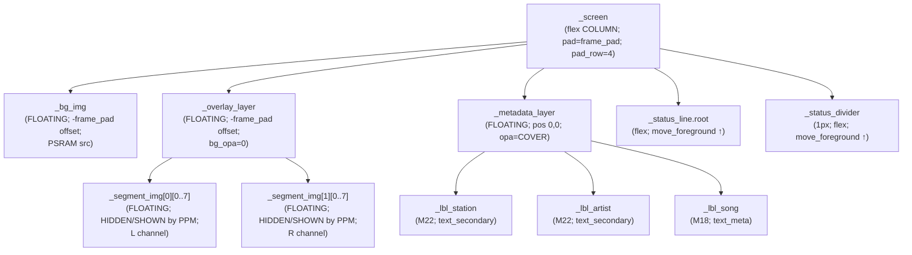

Author: Witaliy76 - https://github.com/Witaliy76

# Visual screen — LVGL object tree (`scr_visual`)

**Purpose / Назначение:**
**English:** Parent → child hierarchy for the Visual carousel page (`LvglVisualPage`) created in `scr_visual.cpp`, covering the floating layer stack, segment grid, metadata labels, status chrome, z-order model, and the two independent update pipelines (PPM timer + page update). Use when reasoning about z-order, coordinate compensation, PSRAM lifecycle, PPM calibration, or metadata state.
**Русский:** Иерархия родитель → потомок для страницы Visual (`LvglVisualPage`) из `scr_visual.cpp`: floating слои, сетка сегментов, метаданные, status chrome, z-order, два независимых конвейера обновления (PPM таймер + page update). Удобно при анализе z-order, компенсации координат, lifecycle PSRAM, PPM калибровки или состояния метаданных.

**Source of truth:**
`scr_visual.cpp`:
- `LvglVisualPage::create()` — orchestration skeleton
- Private static builders: `create_background`, `create_overlay_layer`, `create_segment_grid`, `create_metadata_layer`, `create_status_chrome`, `create_ppm_timer`
- PPM pipeline: `_onPpmTimerTick`, `update_channel_ballistics`, `hybrid_target_db`, `_renderChannel`
- Metadata pipeline: `_refreshMetadata`, `_onStationIdentityChanged`
- Background lifecycle: `_loadBackgroundFromLittlefs`, `_releaseBackgroundBuffer`, `_applyBackgroundImage`, `_syncBackgroundLayout`, `_syncOverlayLayout`

**Maintenance / Поддержка:**
After any of the following, refresh the ASCII tree, Mermaid diagram, and relevant pipeline sections:
- adding/removing a floating layer or flex child;
- changing parent-child relationships or creation order;
- changing z-order (move_foreground calls);
- changing coordinate compensation or segment geometry;
- changing PPM timer period, ballistics constants, or threshold table;
- changing the metadata dirty-detection or stale-guard logic;
- changing PSRAM ownership or background reload conditions.
**После** изменения floating-слоёв, z-order, координатной компенсации, PPM констант или логики stale-guard — обновлять ASCII, Mermaid и соответствующие pipeline разделы.

---

## Layer and z-order model

`_screen` uses `LV_FLEX_FLOW_COLUMN` with `pad_all = frame_padding`. Floating layers are positioned with `-frame_padding` offset to compensate and fill the full panel.

Z-order bottom → top (after `lv_obj_move_foreground` calls in `create()`):

```
1. _bg_img           FLOATING — museum background image (PSRAM)
2. _overlay_layer    FLOATING — transparent container for segment grid
3. _metadata_layer   FLOATING — station / artist / song labels
4. _status_line.root flex-managed, moved foreground — clock / Wi-Fi / weather glance
5. _status_divider   flex-managed, moved foreground — 1 px horizontal divider
```

`_status_line.root` and `_status_divider` are **not FLOATING** — they remain flex children. `lv_obj_move_foreground()` is called explicitly after `lv_obj_update_layout()` to raise them above the floating layers. This ensures metadata and segments can never visually cover the status row.

Всё, что выше `_metadata_layer` — status chrome — не перекрывается метаданными.

---

## Order on `_screen`

`_screen` is a flex **COLUMN** (top → bottom). `pad_all = LV_ACTIVE_PROFILE.frame_padding`, `pad_row = 4`.

**Creation order (load-bearing — do not reorder):**

1. `_bg_img` — created by `create_background`; FLOATING
2. `_overlay_layer` — created by `create_overlay_layer`; FLOATING; `_segment_img[2][8]` children created by `create_segment_grid`
3. `_metadata_layer` — created by `create_metadata_layer`; FLOATING; labels as children
4. `_status_line.root` — created by `wgt_status_line::create` inside `create_status_chrome`
5. `_status_divider` — created by `visual_create_status_divider` inside `create_status_chrome`

After creation, `lv_obj_update_layout(_screen)` runs, then:
```cpp
lv_obj_move_foreground(_status_line.root);
lv_obj_move_foreground(_status_divider);
```

---

## Tree (ASCII)

```
_screen  (flex COLUMN; pad_all=frame_pad; pad_row=4; not scrollable)
│
├── _bg_img                      FLOATING; pos(-frame_pad, -frame_pad); size(480×480)
│                                src → &_bg_psram_dsc  |  HIDDEN if load failed
│
├── _overlay_layer               FLOATING; pos(-frame_pad, -frame_pad); size(480×480)
│                                bg_opa=0; border=0; pad=0
│   ├── _segment_img[0][0..7]    FLOATING; pos=overlay_rect[0][seg].x1/y1; HIDDEN by default
│   └── _segment_img[1][0..7]    FLOATING; pos=overlay_rect[1][seg].x1/y1; HIDDEN by default
│
├── _metadata_layer              FLOATING; pos(0,0); size(480×480)
│                                bg_opa=TRANSP; border=0; pad=0; opa=COVER (static)
│   ├── _lbl_station             pos(19, 74);  size(432×28); M22; text_secondary; LONG_DOT
│   ├── _lbl_artist              pos(28,352);  size(412×28); M22; text_secondary; LONG_DOT
│   └── _lbl_song                pos(28,384);  size(412×22); M18; text_meta;      FU6 scroll (shared)
│
├── _status_line.root            flex-managed (not FLOATING); lv_obj_move_foreground ↑
└── _status_divider              flex-managed (not FLOATING); 1 px; lv_obj_move_foreground ↑
```

Each `_segment_img[ch][seg]` has:
- `src` = `img_beocord_segment_a8` (Flash A8 luminosity mask)
- `img_recolor` = museum green (seg 0..4) or museum red (seg 5..7)
- `recolor_opa` = `LV_OPA_COVER`
- Initial state: `LV_OBJ_FLAG_HIDDEN`

---

## Mermaid diagram



---

## Coordinate model

### Background and overlay

Both `_bg_img` and `_overlay_layer` use:
```
position: (-frame_pad, -frame_pad)
size:      panel_width × panel_height
```
This compensates the root `pad_all = frame_padding`, so both layers fill the full 480×480 panel without gaps.
Это компенсирует `pad_all = frame_padding` корня, заполняя полную панель 480×480 без зазоров.

### Metadata layer

`_metadata_layer` uses `pos(0, 0)` without compensation — its children use absolute pixel coordinates relative to the **content area** origin (top-left of pad-inset area).

Positions in px (content-area coordinates):
```
_lbl_station:  x=19,  y=74,  w=432, h=28
_lbl_artist:   x=28,  y=352, w=412, h=28
_lbl_song:     x=28,  y=384, w=412, h=22   (FU6 scroll; H < line height → vertical roll when short)
```

### Segments

Segment positions come from `kBeocordVuAssetPack.overlay_rect[ch][seg]` in `beocord_vu_asset_pack.h`. The overlay is positioned at `-frame_pad` offset, so segment coordinates in the asset pack are in **panel pixel space** (0…479).

L row: y ≈ 162–206 px
R row: y ≈ 270–314 px
Each segment: ~40 px wide

---

## Background and PSRAM lifecycle

```
ThemePreset (yoradio_theme_active_preset())
        ↓
beocord_background_path_for_preset()   → LittleFS path string
        ↓
LittleFS.open(path, "r")
        ↓
ps_malloc(data_size)                   → _bg_psram_buf
        ↓
_bg_psram_dsc  { header, data_size, data=_bg_psram_buf }
        ↓
lv_image_set_src(_bg_img, &_bg_psram_dsc)
```

**Ownership invariants:**
- `_bg_psram_buf` is owned by `LvglVisualPage`; LVGL holds a pointer into it via the descriptor.
- Before reloading, `_releaseBackgroundBuffer()` frees the old buffer first.
- The descriptor `_bg_psram_dsc` must never outlive `_bg_psram_buf`.
- `destroy()` and `releaseAfterAutoDelete()` always call `_releaseBackgroundBuffer()`.
- If load fails, `_bg_img` is hidden; screen falls back to `device_background` color.
- Theme switch triggers reload only when `_loaded_bg_theme != active_theme`.

**Invariанты владения:**
- `_bg_psram_buf` принадлежит `LvglVisualPage`; LVGL держит указатель через дескриптор.
- Перед перезагрузкой старый буфер освобождается через `_releaseBackgroundBuffer()`.
- Дескриптор `_bg_psram_dsc` не должен переживать `_bg_psram_buf`.
- `destroy()` и `releaseAfterAutoDelete()` всегда освобождают PSRAM.

---

## PPM data/render pipeline

```
PCM producer (Audio task) → ppmPcmLevelAccumulateFrame(left, right, sample_rate)
        ↓
PpmPcmLevelSnapshot  (seqlock; read in DspTask)
        ↓
ppmPcmLevelReadSnapshot() — every 30 ms in _onPpmTimerTick
  snap.block_id != _last_pcm_block_id  → new data available
        ↓
hybrid_target_db(short_peak, slow_rms_sum², slow_frames, fast_rms_sum², fast_frames)
  body_db      = slow_rms_dbfs + 14 dB calibration
  activity_db  = (fast_rms - slow_rms) × 1.5, bounded [-2, +1] dB
  transient_db = (crest_db - 10 dB floor), bounded [0, +4] dB
  → clamp(-60, +5 dB)
        ↓
PCM stale check: if last_pcm_seen_tick==0 OR elapsed > 300 ms
  → target_l = target_r = -60 dB (off)
        ↓
update_channel_ballistics(state, target, dt_ms)   [per channel, independent]
  attack: target >= displayed → instant, reset hold
  hold:   hold_remaining > 0  → count down, no movement
  release: hold == 0 → subtract 12 dB/s × dt; floor = -60 dB
        ↓
db_to_segment_count(displayed_db)  → 0..8
        ↓
_renderChannel(ch, count)          → only updates if count changed
        ↓
_segment_img[ch][seg]: HIDDEN/SHOWN
```

**PPM parameters:**

| Parameter | Value |
|---|---|
| Timer period | 30 ms (~33 Hz) |
| Max dt clamp | 100 ms |
| PCM stale timeout | 300 ms |
| Peak hold | 120 ms |
| Release rate | 12 dB/s |
| RMS calibration | +14 dB |
| Activity gain | ×1.5 |
| Activity bounds | [-2, +1] dB |
| Transient crest floor | 10 dB |
| Transient max boost | +4 dB |
| Off level | −60 dB |
| Target max | +5 dB |

**Segment threshold table (8 thresholds, segments 0..7):**

```
Seg 0: -20 dB  (green)
Seg 1:  -8 dB  (green)
Seg 2:  -3 dB  (green)
Seg 3:  -1 dB  (green)
Seg 4:   0 dB  (green)
Seg 5:  +1 dB  (red)
Seg 6:  +2 dB  (red)
Seg 7:  +5 dB  (red)
```

**Invariants:**
- L and R channels are fully independent.
- Segment objects are never recreated per tick; only `LV_OBJ_FLAG_HIDDEN` is toggled.
- Segment visibility updates only when `count != _rendered_count[channel]`.
- Station change calls `ppmPcmLevelRequestReset()` and zeros both channels.
- L/R каналы полностью независимы.
- Объекты сегментов не пересоздаются; только `LV_OBJ_FLAG_HIDDEN` переключается.

---

## Metadata pipeline and stale-title guard

```
config.lastStation()      → station_id
config.station.name       → st_name
config.station.title      → st_title
player.hasError()         → error state
        ↓
Dirty detection:
  name_dirty  = force || is_initial || genuine_station_change || name != cached_name
  title_dirty = force || is_initial || genuine_station_change
             || cached_raw empty || title != cached_raw
        ↓
Station identity transition:
  genuine_station_change → _onStationIdentityChanged():
    snapshot _title_at_station_switch = st_title   ← stale-guard arm
    clear _cached_raw_title
  is_initial → cache bootstrap (stale guard NOT armed; _title_at_station_switch = "")
        ↓
Name update: visual_set_text_if_changed(_lbl_station, st_name)
        ↓
Title processing (stale-guard + filters):
  if player.hasError()          → song = lastError()
  elif stale_guard_active       → artist = "", song = ""   (old title, new station)
  elif is_transport_title()     → artist = "", song = ""   (service string hidden)
  elif empty || == st_name      → artist = "", song = ""   (duplicate or empty)
  else split at " - ":
    found  → artist = left, song = right
    absent → artist = "", song = full_title
        ↓
visual_set_text_if_changed(_lbl_artist, artist_buf)
visual_set_text_if_changed(_lbl_song,   song_buf)
```

**Stale-guard mechanics:**
After a genuine station change, `_title_at_station_switch` holds the title that was current at the switch moment. As long as the incoming `config.station.title` equals this snapshot, artist/song remain blank — preventing the previous station's metadata from appearing on the new station. The guard clears automatically when the new station's first title arrives (NEWTITLE event), because `st_title != _title_at_station_switch`.

**Механика stale-guard:**
После смены станции `_title_at_station_switch` хранит snapshot title в момент переключения. Пока `config.station.title` равен этому snapshot — artist/song пусты; чужие метаданные не отображаются. Guard снимается автоматически, когда приходит первый title новой станции (NEWTITLE).

**Transport/service titles filtered by `visual_is_transport_title()`:**
`[соединение]`, `[connecting]`, `(connection)`, `[готов]`, `[ready]`, `[остановлено]`, `[stopped]`, `timeout`

**Metadata opacity:** currently static at `LV_OPA_COVER`. Fade animation is not implemented.

---

## Update cadence

Two independent update cadences — **do not merge**:

```
PPM (segment visibility):
  LVGL timer, ~30 ms period, DspTask
  _ppmTimerCallback → _onPpmTimerTick
  Paused on exit(), resumed on enter()

Metadata + status line:
  Display loop cadence (page update)
  LvglVisualPage::update() → wgt_status_line::update + _refreshMetadata(false)
```

`enter()` also calls an **immediate** snapshot of both pipelines (without waiting for the next tick):
```cpp
wgt_status_line::update(_status_line);
_refreshMetadata(true);
```

---

## Runtime theme behavior

| Element | Theme-dependent? |
|---|---|
| Background image | ✅ yes — asset path from `ThemePreset` |
| Segment green/red colors | ❌ no — fixed `0x59F08A` / `0xF06868` |
| `_lbl_station`, `_lbl_artist` color | ✅ yes — `pal.text_secondary` |
| `_lbl_song` color | ✅ yes — `pal.text_meta` |
| `_status_divider` color | ✅ yes — `pal.divider` |
| Status line | ✅ yes — via `wgt_status_line::reapplyTheme` |
| Screen background color | ✅ yes — `pal.device_background` |

`liveReapplyTheme()`:
1. Applies palette colors to all owned elements.
2. If `active_theme != _loaded_bg_theme` → calls `_applyBackgroundImage()` (reload + re-set src).
3. Otherwise → `lv_obj_invalidate(_screen)` (force redraw without reload).
4. Does **not** recreate segment objects.
5. Does **not** reset PPM state.

---

## PageChain lifecycle and auto-delete

| Call | Action |
|---|---|
| `create()` | Builds object tree; creates PPM timer **paused**; installs carousel gestures |
| `enter()` | Enables PCM source; resumes PPM timer; applies background; immediate metadata/status snapshot |
| `exit()` | Pauses PPM timer (source stays enabled for quick re-entry) |
| `update()` | Status line + metadata refresh at page-update cadence |
| `liveReapplyTheme()` | Repaints palette + reloads background if theme changed |
| `prepareForAutoDelete()` | Deletes PPM timer; disables PCM source — before LVGL deletes object tree |
| LVGL deletes tree | (automatic via PageChain auto-delete) |
| `releaseAfterAutoDelete()` | Nulls all handles + frees PSRAM buffer |
| `destroy()` | Explicit destroy: same as prepareForAutoDelete + `lv_obj_delete` + null/free |

**Critical invariant:** PPM timer must be deleted before LVGL deletes `_segment_img` objects.
`prepareForAutoDelete()` guarantees `_deletePpmTimer()` runs **before** the object tree is freed.
No timer callback can fire on a dangling `_segment_img` pointer.

**Критический инвариант:** PPM таймер должен быть удалён до удаления объектов сегментов LVGL.
`prepareForAutoDelete()` гарантирует `_deletePpmTimer()` перед освобождением дерева объектов.

---

## Notes / Заметки

```
VISUALREF-A:
visual_create_status_divider() moved into anonymous namespace (was incorrectly placed
after its closing brace). No behavior change; function body unchanged.
Stage-history comments (E3/E4/E5B/E6C1/E6C2) replaced with current-state descriptions.
Line-number cross-references to scr_main.cpp removed (drift-prone).
_last_pcm_sample_rate annotated as diagnostic write-only.
scr_visual_layout_tree.md created.
```

- **`_last_pcm_sample_rate`:** written on every new PCM block and cleared on station change / destroy; currently never read. Kept for potential future use (sample-rate display or diagnostics).
- **`PpmChannelState`:** defined in `scr_visual.h` (not anonymous namespace) because it is the type of a private value member `_ppm_state[2]` and the compiler needs the full type in the header.
- **Board guard:** `kBeocordVuAssetPack.segment_mask == nullptr` on non-4848S040 boards. `create_overlay_layer`, `create_segment_grid`, and `create_ppm_timer` all check this guard and no-op safely.
- All `lv_*` calls run on **DspTask only**, via `Display::loop()` → `refreshVisualScreen()` → `update()`, and LVGL timer callbacks (also DspTask).
- **`_board guard`:** `kBeocordVuAssetPack.segment_mask == nullptr` на платах не 4848S040. Все три builder-а проверяют это и безопасно делают no-op.
