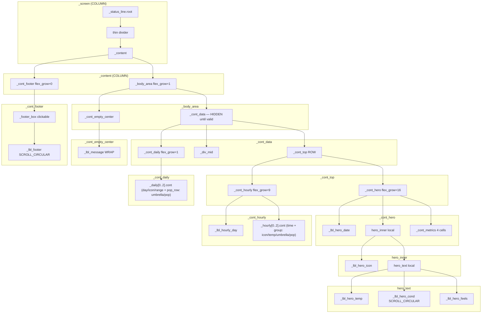

Author: Witaliy76 - https://github.com/Witaliy76

# Weather screen — LVGL object tree (`scr_weather`)

**Purpose / Назначение:**
**English:** Parent → child hierarchy for the Weather Page object tree created by `LvglWeatherPage::create()` and its private static layout builders in `scr_weather.cpp`, plus the read-only data/render flow that drives `update()`. Use when reasoning about layout, flex, visible states, render cache, footer behavior, and theme retint.
**Русский:** Иерархия родитель → потомок для Weather Page, создаваемого `LvglWeatherPage::create()` и private static layout builders в `scr_weather.cpp`, а также read-only поток данных/рендера для `update()`. Удобно для разметки, flex, видимых состояний, кэша рендера, поведения футера и retint темы.

**Source of truth:**
`scr_weather.cpp`:
`LvglWeatherPage::create()` + private static `create_*` layout builders
(`create_chrome`, `create_data_block`, `create_empty_center`, `create_footer`)
are the source of truth for the object tree. `LvglWeatherPage::update()` plus its WEATHERREF-B pipeline helpers (`_deriveViewState`, `_makeRenderDecision`, `_renderWeatherData`, `_renderEmptyState`, `_updateFooterText`, `_commitFullRenderCache`, `_commitFooterOnlyCache`) are the source of truth for the data/render flow described below.

**Maintenance / Поддержка:**
After any of the following, refresh the ASCII tree, the Mermaid block, and the data/render flow section so they stay accurate:
- adding/removing a container or label;
- renaming a member or container;
- changing a parent-child relationship or sibling order;
- changing the `create_*` builder boundaries;
- changing the render-state pipeline (view signature, buckets, cache commit, snapshot handling).
**После** добавления контейнера, переименования, изменения parent-child, границ билдеров или render-state pipeline — обновлять ASCII, Mermaid и data-flow разделы.

---

## Order on `_screen`

`_screen` is a flex **column** (top → bottom). `pad_all = LV_ACTIVE_PROFILE.frame_padding`, `pad_row = 6`.

1. `_status_line.root` — `wgt_status_line` (clock / Wi-Fi / weather glance; see `../widgets/wgt_status_line.cpp`)
2. `<thin divider>` — 1 px `add_thin_divider()` line (local, non-member)
3. `_content` — `flex_grow = 1`, COLUMN; holds the body + footer

`_content` is a flex **column**:
- `_body_area` — `flex_grow = 1`; hosts `_cont_data` (forecast) **and** `_cont_empty_center` (message), toggled by visibility
- `_cont_footer` — `flex_grow = 0`; pinned at the bottom (status pill; tap returns to Main)

**Sibling/creation order is load-bearing:** inside `_body_area`, `_cont_data` is created **before** `_cont_empty_center`; `_cont_footer` is created last inside `_content`. Only one of `_cont_data` / `_cont_empty_center` is visible at a time; `_cont_footer` is always visible.

---

## Tree (ASCII)

Local containers created inside builders but **not** stored as members are marked `(local)`.

```
_screen
├── _status_line.root            (wgt_status_line — see ../widgets/wgt_status_line.cpp)
├── <thin divider>               (local; 1 px add_thin_divider)
└── _content
    ├── _body_area
    │   ├── _cont_data            (HIDDEN until current+forecast valid)
    │   │   ├── _cont_top         (ROW; hero 16 : hourly 9; flex_grow=0)
    │   │   │   ├── _cont_hero    (panel; flex_grow=16)
    │   │   │   │   ├── _lbl_hero_date
    │   │   │   │   ├── hero_inner            (local ROW; icon + text column)
    │   │   │   │   │   ├── _lbl_hero_icon
    │   │   │   │   │   └── hero_text         (local COLUMN; flex_grow=1)
    │   │   │   │   │       ├── _lbl_hero_temp
    │   │   │   │   │       ├── _lbl_hero_cond   (LV_LABEL_LONG_SCROLL_CIRCULAR)
    │   │   │   │   │       └── _lbl_hero_feels
    │   │   │   │   └── _cont_metrics         (ROW; 4 equal cells)
    │   │   │   │       ├── metric cell wind      (local cell)
    │   │   │   │       │   ├── icon slot  (local) → icon label (local)
    │   │   │   │       │   ├── value slot (local) → _val_wind
    │   │   │   │       │   └── label slot (local) → _lbl_wind
    │   │   │   │       ├── metric cell humidity   (local cell)
    │   │   │   │       │   ├── icon slot  (local) → icon label (local)
    │   │   │   │       │   ├── value slot (local) → _val_humidity
    │   │   │   │       │   └── label slot (local) → _lbl_humidity
    │   │   │   │       ├── metric cell pressure   (local cell)
    │   │   │   │       │   ├── icon slot  (local) → icon label (local)
    │   │   │   │       │   ├── value slot (local) → _val_pressure
    │   │   │   │       │   └── label slot (local) → _lbl_pressure
    │   │   │   │       └── metric cell rain       (local cell)
    │   │   │   │           ├── icon slot  (local) → icon label (local)
    │   │   │   │           ├── value slot (local) → _val_rain
    │   │   │   │           └── label slot (local) → _lbl_rain
    │   │   │   └── _cont_hourly  (panel; flex_grow=9)
    │   │   │       ├── _lbl_hourly_day
    │   │   │       ├── _hourly[0].cont   (local ROW)
    │   │   │       │   ├── _hourly[0].time
    │   │   │       │   └── group (local ROW)
    │   │   │       │       ├── _hourly[0].icon
    │   │   │       │       ├── _hourly[0].temp
    │   │   │       │       ├── _hourly[0].pop_icon (umbrella)
    │   │   │       │       └── _hourly[0].pop
    │   │   │       ├── _hourly[1].cont   (local ROW; same children as [0])
    │   │   │       └── _hourly[2].cont   (local ROW; same children as [0])
    │   │   ├── _div_mid          (1 px add_thin_divider)
    │   │   └── _cont_daily       (panel; ROW; flex_grow=1 — absorbs slack to footer)
    │   │       ├── _daily[0].cont   (cell; right-border internal separator)
    │   │       │   ├── _daily[0].day
    │   │       │   ├── _daily[0].icon
    │   │       │   ├── _daily[0].range
    │   │       │   └── pop_row (local ROW)
    │   │       │       ├── _daily[0].pop_icon (umbrella)
    │   │       │       └── _daily[0].pop
    │   │       ├── _daily[1].cont   (cell; right-border internal separator)
    │   │       │   └── … same children as [0] …
    │   │       └── _daily[2].cont   (cell; no separator)
    │   │           └── … same children as [0] …
    │   └── _cont_empty_center   (flex_grow=1; centered message; sibling AFTER _cont_data)
    │       └── _lbl_message     (LV_LABEL_LONG_WRAP)
    └── _cont_footer             (flex_grow=0; pinned bottom)
        └── _footer_box          (clickable pill via wgt_footer_pill; _onFooterReturnToMainClick)
            └── _lbl_footer      (LV_LABEL_LONG_SCROLL_CIRCULAR; passivated via wgt_footer_pill::make_child_passive)
```

Notes:
- `hero_inner`, `hero_text`, each metric `cell` / `slot`, each hourly `group`, and each daily `pop_row` are **local** (non-member) containers — implementation detail of the cell factories, not part of the member-handle contract.
- The forecast presents `daily[1..3]` and `hourly[1..3]` of `WeatherState` (slot 0 = "today / now" is shown in the hero block).

---

## Diagram (Mermaid)

Render in GitHub / VS Code Markdown preview / Mermaid-compatible tools.



---

## Weather data/render flow

`update()` is a read-only consumer of core `WeatherState`. One snapshot per render pass; no network from the UI. WEATHERREF-B organizes the former monolithic `update()` into an explicit derivation → decision → render → commit pipeline. **Behavior and on-screen output are unchanged** — the same flags, signature bits, buckets, cache fields and texts are produced.

```
weatherGetStateSnapshot() — one snapshot per update pass
        ↓
WeatherViewState derivation              (_deriveViewState; pure)
        ↓
WeatherRenderDecision                    (_makeRenderDecision)
        ├── no-op            → return; cache untouched
        ├── footer-only      → _updateFooterText → _commitFooterOnlyCache (minute bucket only)
        └── full render
              ├── data        → _renderWeatherData(snap)
              └── empty/loading/error → _renderEmptyState(view)
        ↓
footer application                       (_updateFooterText — shared by all render paths)
        ↓
full / footer-only cache commit          (_commitFullRenderCache / _commitFooterOnlyCache)
```

### Pipeline methods (WEATHERREF-B)

POD render types — stack-only, never published, no dynamic allocation:
- `LvglWeatherPage::WeatherViewState` — derived visible-state flags + `view_sig` + `minute_bucket` + `day_key`.
- `LvglWeatherPage::WeatherRenderDecision` — `force_full` / `version_changed` / `view_changed` / `day_changed` / `minute_changed` / `full_render_needed` / `footer_only_needed`.

Private methods:
- `_deriveViewState(snap, now_ms) const` — pure derivation; no snapshot read, no member mutation, no LVGL, no formatting, no network. Captures `show_refreshing_footer` (automatic fetch in progress) and `view_sig`.
- `_makeRenderDecision(snap, view) const` — dirty categories from the render cache + snapshot version + derived view.
- `_renderWeatherData(snap)` — hero / metrics / hourly / daily (verbatim from the old body).
- `_renderEmptyState(view)` — hide data, show centered message (disabled / unavailable / loading / waiting).
- `_updateFooterText(snap, view)` — single shared footer-apply path (`wx_format_footer` → `wx_footer_maybe_add_trailing_sep` → `wx_set_text_if_changed`).
- `_commitFullRenderCache(snap, view)` — commits all five cache fields (data and empty paths share it).
- `_commitFooterOnlyCache(view)` — advances **only** `_rendered_minute_bucket`.

Invariants:
- **Exactly one** `weatherGetStateSnapshot()` per update pass (into a function-`static WeatherState` to keep it off the DspTask stack). Render helpers never re-read `WeatherState`; the footer tap callback reads no weather data.
- **One `millis()` read** per pass (`now_ms`) feeds age/stale, the minute bucket and the pending timeout (same formulas as baseline).
- **No-op fast path** — returns without touching the cache when the visible state is unchanged.
- **Footer-only path** — changes only `_rendered_minute_bucket`.
- **Full render path** — commits `_rendered_version`, `_rendered_view_sig`, `_rendered_minute_bucket`, `_rendered_day_key`, `_render_cache_valid`.
- **Full render** triggers on new `version`, changed `view_sig`, or changed `day_key`; **footer-only** when only the minute bucket changes.
- The data body (`_cont_data`) requires **both** `current.valid` **and** `forecast_valid` (W2 narrowing: current is filled from the forecast).
- **Responsibility split:** WEATHERREF-A owns the layout / builders / `create()`; WEATHERREF-B owns the `update()` / render-pipeline organization. Neither changes behavior or output.

---

## Visible states

Exactly one of `_cont_data` / `_cont_empty_center` is shown; `_cont_footer` is always shown.

- **data** — `wxEnabled && current+forecast valid`: `_cont_data` visible (hero / hourly / daily), footer shows location + age + tap hint.
- **loading** — enabled, no data, `fetch_in_progress` or `InternalLow`: centered message `kStrPleaseWait`.
- **unavailable / error** — enabled, no data, terminal error (`FetchFailed` / `NotConfigured` / `NotConnected`): message `kStrTemporarilyUnavailable`, footer shows the status + tap-to-return-to-Main hint.
- **disabled / no data** — `!wxEnabled`: message `kStrWeatherUnavail`, footer shows the status + tap-to-return-to-Main hint.
- **waiting** — enabled, no data, no error yet: message `kStrForecastWaiting`.
- **stale** — has data but `stale` flag or age > `WEATHER_STALE_AFTER_MS`: footer shows `kStrDataMayBeOutdated` + tap-to-return-to-Main hint.
- **refreshing footer** — has data and an automatic fetch is in progress: footer shows `kStrFooterRefreshing`.

These are documentation of existing behavior; neither WEATHERREF-A nor WEATHERREF-B changes the logic.

---

## Render cache and update cadence

- `Display::loop()` calls `refreshWeatherScreen()` ~1 Hz while the Weather carousel slot is active.
- Cache fields: `_render_cache_valid`, `_rendered_version`, `_rendered_view_sig`, `_rendered_minute_bucket`, `_rendered_day_key`.
- `enter()` sets `_render_cache_valid = false` so the first `update()` after navigation is always a full render.
- `_nullHandles()` (manual destroy / auto-delete release) resets the cache so the next `enter()` renders into fresh widgets.

---

## Footer overflow and tap behavior

- **Return to Main (FU4.2.25):** tapping `_footer_box` calls `_onFooterReturnToMainClick` → `lv_async_call` → `goToCarouselPage(PageChain::MAIN_INDEX)`. Deferred because `goTo()` synchronously auto-deletes this page tree; a file-static pending flag drops repeat taps, and the async step skips navigation if the carousel already left Weather. The manual refresh action was retired — weather refreshes automatically; the pill text stays informational (location / age / stale / updating) with the action hint `WeatherTapToReturnToMain`.
- **Gestures:** `_footer_box` has `LV_OBJ_FLAG_GESTURE_BUBBLE`, so a horizontal swipe started on the pill still reaches the carousel handler on the screen root.
- **Composition:** optional `location` prefix + body (`age` / status + action), segments joined by `kStrFooterSep` (U+2022 •).
- **Trailing separator:** appended **only when the text overflows** the footer label width — circular scroll needs the gap between repeated copies; static text that fits does not (`wx_footer_maybe_add_trailing_sep`).
- `_lbl_footer` uses `LV_LABEL_LONG_SCROLL_CIRCULAR`.
- **Footer visual contract uses `wgt_footer_pill` (FOOTERPILL-1):** `wx_style_footer_pill_clickable` now delegates to `wgt_footer_pill::prepare_surface` + `apply_palette`. `liveReapplyTheme()` calls `wgt_footer_pill::apply_palette(_footer_box, pal)`. Weather-specific reset (`wx_flat_base`, padding) remains local. Screen owns geometry, text, callback, action; widget owns fixed normal/pressed states and palette colors.

---

## Runtime theme behavior

- `liveReapplyTheme()` retints colors and forces `LV_GRAD_DIR_NONE` **without recreating objects** and **without** `remove_style_all` on existing widgets (that would erase flex/layout).
- It repaints hero / hourly / daily panel backgrounds and borders, re-applies daily internal separators, retints all labels, and walks the tree to flatten any inherited gradient.
- The **render cache is not reset** on an ordinary theme switch — `liveReapplyTheme()` does not call `update()` and leaves `_rendered_*` untouched.

---

## PageChain lifecycle

- `create()` — builds the object tree via the four `create_*` builders, then installs carousel gestures on `_screen`. No initial `update()` and no cache reset here.
- `enter()` — invalidates the render cache and calls `update()` (initial full render).
- `exit()` — diagnostics only; no teardown (PageChain may auto-delete on the next switch).
- `destroy()` — manual delete path: `lv_obj_delete(_screen)` then `_nullHandles()`.
- `releaseAfterAutoDelete()` — LVGL already deleted the tree (`auto_del`); only `_nullHandles()` (never `lv_obj_delete`).
- `_nullHandles()` — resets the render cache and nulls every member handle so the next recreate starts clean.
- PageChain recreate: data lives in core `WeatherState`, so a fresh `create()` + `enter()` rebuilds the screen with no UI-side persistence.

---

## Notes / Заметки

```
WEATHERREF-A:
create() is intentionally a short orchestration skeleton.
Object creation is split into private static layout builders.

WEATHERREF-B:
update() is intentionally a short orchestration pipeline.
Derivation, render branches and cache commit are split into private methods.
Behavior and on-screen output remain unchanged; this document tracks the pipeline.
```

- **WEATHERREF-A:** `LvglWeatherPage::create()` is now a short skeleton; object creation is split into private static layout builders (`create_chrome`, `create_data_block`, `create_empty_center`, `create_footer`) in `scr_weather.cpp`. This document describes the resulting LVGL object tree and the read-only data/render flow, not the physical location of every `lv_obj_create()` call.
  **WEATHERREF-A:** `create()` теперь короткий skeleton; создание объектов разнесено по private static layout builders. Документ описывает итоговое дерево и read-only поток данных/рендера, а не физическое место каждого `lv_obj_create()`.
- **WEATHERREF-B:** `LvglWeatherPage::update()` is now a short orchestration pipeline; visible-state derivation, the render decision, the data/empty render branches, the shared footer apply and the cache commits live in private methods (see *Pipeline methods* above). The object tree is unchanged. Behavior, signature bits, minute/day buckets, cache semantics and on-screen text are byte-for-byte equivalent to the pre-refactor `update()`.
  **WEATHERREF-B:** `update()` теперь короткий конвейер; derivation, решение о рендере, ветки data/empty, общий футер и commit кэша вынесены в private-методы. Дерево объектов не изменилось; поведение и вывод идентичны прежнему `update()`.
- **W2 narrowing:** `WeatherState.current` is filled from the forecast, so "current valid" == "forecast valid"; the data body requires both.
- Widget `wgt_status_line` is defined in `[../widgets/wgt_status_line.cpp](../widgets/wgt_status_line.cpp)`; only its `root` container is relevant to the Weather layout contract.
- All `lv_*` calls run on `DspTask` only, via `Display::loop()` → `lvgl_ui::taskHandler` / `refreshWeatherScreen()`.
- **Pressure unit:** `WeatherState.current.pressure_hpa` stays in hPa end to end; `_val_pressure` is the only place it is converted, via `weatherHpaToMmHg()` (`kHpaToMmHg`, `weather_state.h`), and rendered as `"%d mmHg"`.
